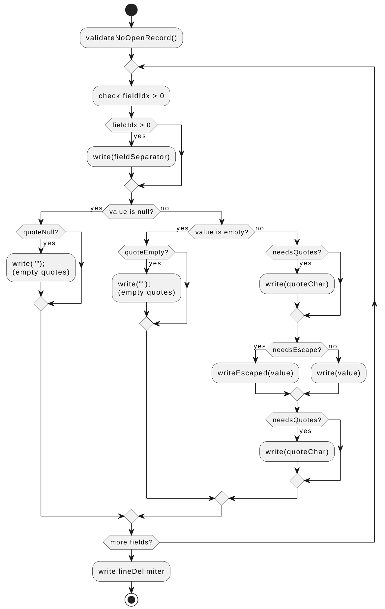

## Graph-Based Testing for `CSVWriter`

### 1) About the Function

The `CsvWriter` class is responsible for writing data in CSV format to various outputs (e.g., files, streams, console). The writing process involves encoding records (including string quoting, delimiter handling, and optional comment lines), managing internal buffers, and controlling the line ending strategy. The control logic in the writer can be naturally expressed using a control flow graph (CFG) due to its numerous branching decisions (e.g., when to quote, when to write separators, how to escape characters, etc.).

### 2) Control Flow Abstraction

The pseudocode below illustrates the logic of the method `writeRecord(String... values)`:

```text
writeRecord(values):
    validateNoOpenRecord()
    for each value in values:
        if fieldIdx > 0:
            write(fieldSeparator)
        if value is null:
            if quoteNull:
                write(empty quotes)
        else if value is empty:
            if quoteEmpty:
                write(empty quotes)
        else:
            if needsQuotes:
                write(quoteCharacter)
            if needsEscape:
                writeEscaped(value)
            else:
                write(value)
            if needsQuotes:
                write(quoteCharacter)
    endRecord()
```

Based on the pseudo code for the `writeRecord(String... values)` method, I have numbered the nodes and extracted the corresponding edges in the format required by the [Graph Coverage web application](https://cs.gmu.edu:8443/offutt/coverage/GraphCoverage).

### **Node Numbering Scheme**

| Node # | Action                                        |
| ------ | --------------------------------------------- |
| 1      | Start                                         |
| 2      | `validateNoOpenRecord()`                      |
| 3      | Begin loop: iterate over fields               |
| 4      | `fieldIdx > 0` check                          |
| 5      | `write(fieldSeparator)`                       |
| 6      | `value == null` check                         |
| 7      | `quoteNull == true` → `write("")`             |
| 8      | `value == ""` check                           |
| 9      | `quoteEmpty == true` → `write("")`            |
| 10     | `needsQuotes == true` → `write(quoteChar)`    |
| 11     | `needsEscape == true` → `writeEscaped(value)` |
| 12     | `write(value)` (when no escape needed)        |
| 13     | `needsQuotes == true` → `write(quoteChar)`    |
| 14     | End of loop → more fields?                    |
| 15     | `write(lineDelimiter)`                        |
| 16     | Stop                                          |

---

#### **Edges List (for input into web app)**

```
1 2
2 3
3 4
4 5
4 6
5 6
6 7
6 8
7 14
8 9
8 10
9 14
10 11
10 12
11 13
12 13
13 14
14 3
14 15
15 16
```

Where initial node is `1` and final node is `16`.

### 3) Corresponding Control Flow Graph (CFG) and Condensed Node Diagram

| Control Flow Diagram                                                 | Condensed Node Diagram                                                                        |
| -------------------------------------------------------------------- | --------------------------------------------------------------------------------------------- |
|  |  |
| [PlantUML Code](./PlantUML/CFG.puml)                                 | [Edges](#Edges-List) (for web app)                                                            |

---

### 4) Graph Testing Details

Based on the graph, the number of independent paths depends on the combinations of:

- null field
- empty string field
- quoted/escaped non-empty string
- non-quoted regular string

Here are a few representative paths:

| Path ID | Description                                  | Path Nodes Sequence (Labels in CFG)                                                      |
| ------- | -------------------------------------------- | ---------------------------------------------------------------------------------------- |
| P1      | Single quoted non-empty field needing escape | Start → validate → fieldSep → needsQuotes → writeQuote → writeEscaped → writeQuote → end |
| P2      | Null field with quote strategy               | Start → validate → quoteNull → write("") → end                                           |
| P3      | Empty field with no quoting                  | Start → validate → empty → skip write → end                                              |
| P4      | Regular field, no quotes, no escape          | Start → validate → write(value) → end                                                    |

### 5) McCabe’s Cyclomatic Complexity

To calculate the cyclomatic complexity:

Let:

- `e = number of edges`
- `n = number of nodes`

From the CFG:

- Nodes (n) = 16
- Edges (e) = 20

Therefore,\
**Cyclomatic Complexity, C = e - n + 2 = 20 - 16 + 2 = 6**

This implies at least 6 independent paths should be tested to achieve basis path coverage but we just need a set of paths such that all 20 edges appear at least once among them and we don’t need to cover every possible path or combination (unlike path or basis path coverage).

### 6) **Testing Coverage Criteria**

**Edge coverage** was selected as the testing coverage criterion to ensure that every edge in the control flow graph of the `writeRecord(String... values)` method is executed at least once. This criterion is appropriate for this method because the function includes multiple conditionals and loops, but all edges can be covered using only five test cases, making the test suite efficient and maintainable while ensuring sufficient structural coverage.

#### **Test Cases**

| Test # | Test Purpose/Description                            | Test Definition (Graph Edge Path) |
| ------ | --------------------------------------------------- | --------------------------------- |
| g-w-01 | Tests a null value that triggers quoteNull strategy | 1→2→3→4→5→6→7→14→15→16            |
| g-w-02 | Tests empty string with quoteEmpty strategy         | 1→2→3→4→6→8→9→14→15→16            |
| g-w-03 | Tests two null values written back-to-back          | 1→2→3→4→6→7→14→3→4→6→7→14→15→16   |
| g-w-04 | Tests unescaped value that needs quoting            | 1→2→3→4→6→8→10→12→13→14→15→16     |
| g-w-05 | Tests escaped value that needs quoting and escaping | 1→2→3→4→6→8→10→11→13→14→15→16     |

#### **Execution Results**

| Test # | Expected Result                                  | Result |
| ------ | ------------------------------------------------ | ------ |
| g-w-01 | Output: `""` followed by line delimiter          | Pass   |
| g-w-02 | Output: `""` followed by line delimiter          | Pass   |
| g-w-03 | Output: `""`,`""` followed by line delimiter     | Pass   |
| g-w-04 | Output: `"value"` followed by line delimiter     | Pass   |
| g-w-05 | Output: `"esca\"ped"` followed by line delimiter | Pass   |

The code for the tests can be found in [TestWriterGraph.java](./tests/TestWriterGraph.java)


[Go Back to Table of Contents](./Readme.md)

[Next Section: Exploratory Testing](./exploratory-testing.md)
