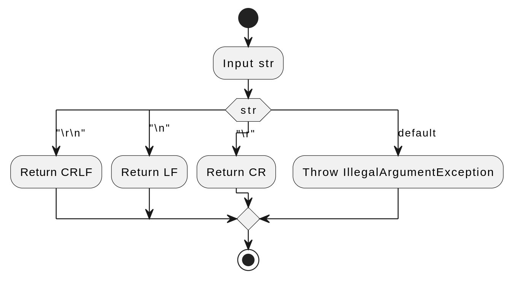
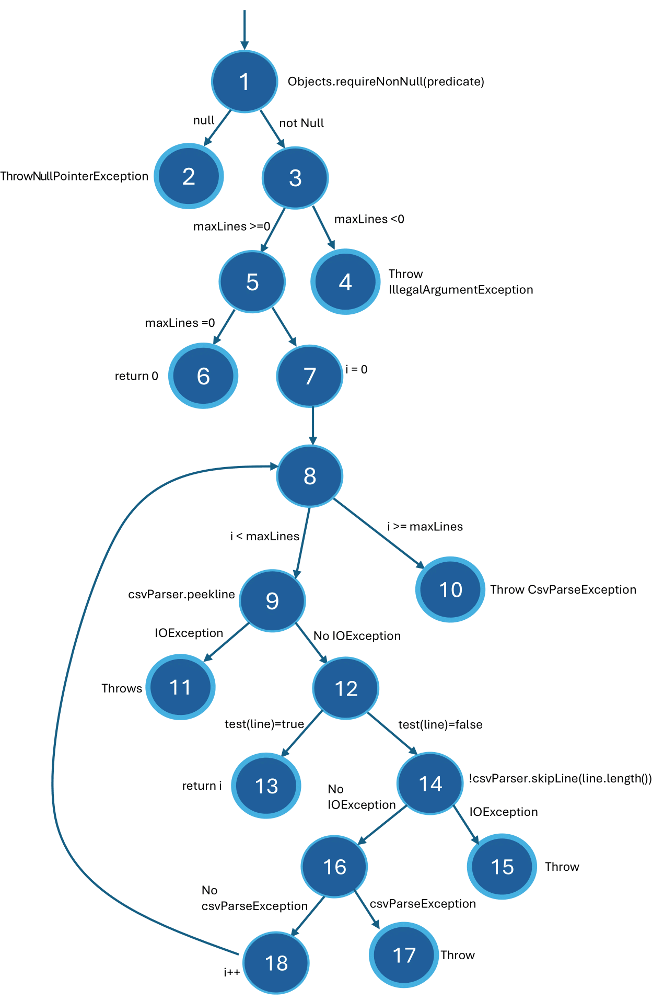

# Progress Report: Testing Open-Source Application

Report Date: 4/4/2025

#### Students Name:

- Santhosh Anitha Boominathan
- Adam Slager

#### Project/Application: FastCSV

FastCSV is a high-performance CSV parser and writer for Java licensed under the [MIT open source license](https://opensource.org/license/mit). It is designed to not only be fast and lightweight but also to be compliant with the CSV specification [RFC 4180](https://datatracker.ietf.org/doc/html/rfc4180).

### Contents

- [Section 1. Input Domain Modeling](#section-1-progress-from-input-domain-modeling)
- [Section 2. Graph-Based Testing](#section-2-progress-from-graph-based-testing)
- [Section 3. Progress Summary](#section-3-progress-summary)

## Input Domain Modeling:

### Introduction

The CSVWriter and CSVReader components were selected for Input Domain Modeling for several practical reasons:
- Using Input Domain Modeling on these higher-level components provides the team with an opportunity to understand the major functionality of FastCSV early in the testing process.  This understanding will assist in designing subsequent tests.
- Since FastCSV is already in production and the primary functionality is fully operational, testing at this level is a practical option at this early stage in the testing process.  If this were an early sprint in an Agile project, this level of testing might not be available, since the functionality would not be fully developed.
- The components, and in particular the csv files themselves, are good targets for Input Domain Testing.  The input domain of the csv files is practically infinite, but those possibilities can be logically partitioned into blocks representing both common use cases and edge cases. This allowed the team to develop a manageable framework for testing a large input space.

### CsvWriter

**Selected Functions/Features for Input Domain Modeling**  
For the `CsvWriter` component, we selected the `writeRecord(String... values)` method as the primary function for testing with input domain modeling. This method is central to the CSV writing process, handling the writing of complete records with multiple fields and applying quoting logic based on the configured `QuoteStrategy`. It’s a critical feature because it directly interacts with user-provided input and encapsulates the core functionality of writing CSV data.

**List of Input Variables**

- `values`: An array of `String` objects representing the fields to write in a single record.
- `fieldSeparator`: A `char` defining the separator between fields (default: `,`).
- `quoteCharacter`: A `char` used to enclose fields (default: `"`).
- `quoteStrategy`: A `QuoteStrategy` object determining when fields are quoted (default: `null`, meaning only required quoting).
- `lineDelimiter`: A `LineDelimiter` enum specifying the end-of-line sequence (default: `CRLF`).

| Input Variable   | Type                             | Constraints                      | Range                                                            |
| ---------------- | -------------------------------- | -------------------------------- | ---------------------------------------------------------------- |
| `values`         | Array of `String`                | Can be `null` or empty           | From 0 to arbitrary length                                       |
| `fieldSeparator` | Single `char`                    | Must not be a newline character  | Any character except newline                                     |
| `quoteCharacter` | Single `char`                    | Must not be a newline character  | Any character except newline                                     |
| `quoteStrategy`  | `QuoteStrategy` object or `null` | Defines quoting behavior         | `null` for minimal quoting, custom strategies for forced quoting |
| `lineDelimiter`  | `LineDelimiter` enum             | Limited to `CR`, `LF`, or `CRLF` | `CR`, `LF`, `CRLF`                                               |

**Partitioning Characteristics into Blocks**

| Input Variable   | Blocks                                   | Values                                                 |
| ---------------- | ---------------------------------------- | ------------------------------------------------------ |
| `values`         | Block 1: `null` values                   | `[null]`                                               |
|                  | Block 2: Empty strings                   | `[""]`                                                 |
|                  | Block 3: Normal strings                  | `["hello", "world"]`                                   |
|                  | Block 4: Strings with special characters | `["comma, separated", "\"quoted\"", "newline\r\n"]`    |
| `fieldSeparator` | Block 1: Default separator               | `','`                                                  |
|                  | Block 2: Alternative separator           | `';'`                                                  |
| `quoteCharacter` | Block 1: Default quote                   | `'"'`                                                  |
|                  | Block 2: Alternative quote               | `'''`                                                  |
| `quoteStrategy`  | Block 1: `null`                          | `null`                                                 |
|                  | Block 2: Custom strategy                 | Custom `QuoteStrategy` forcing all fields to be quoted |
| `lineDelimiter`  | Block 1: `CRLF`                          | `LineDelimiter.CRLF`                                   |
|                  | Block 2: `LF`                            | `LineDelimiter.LF`                                     |

**Coverage Criteria**  
I chose the "Each-Choice" coverage criterion, which ensures that each block of every input variable is tested at least once. This provides a balanced approach, covering key scenarios (e.g., normal usage, edge cases with special characters) without the combinatorial explosion of "All-Combinations" coverage, given the number of variables.

**Test Set Definition**

- Test 1: `writeRecord("hello", "world")` with default settings (`fieldSeparator=','`, `quoteCharacter='"'`, `quoteStrategy=null`, `lineDelimiter=CRLF`).
- Test 2: `writeRecord(null, "")` with `fieldSeparator=';'`, `quoteCharacter='''`, `quoteStrategy=null`, `lineDelimiter=LF`.
- Test 3: `writeRecord(",", "\"quoted\"")` with default settings.
- Test 4: `writeRecord("\r\n")` with custom `QuoteStrategy` forcing quotes, `fieldSeparator=','`, `quoteCharacter='"'`, `lineDelimiter=CRLF`.

**Execution Results**  
TODO

---

#### CsvReader

**Selected Functions/Features for Input Domain Modeling**  
For the `CsvReader` component, my teammate selected the `ofCsvRecord(Path file)` method for testing with input domain modeling. This method is a high-level entry point for reading CSV files, leveraging the `CsvReaderBuilder` and `CsvParser` to process file input into `CsvRecord` objects. It’s a suitable choice as it encapsulates the full reading process and allows testing of file-based input handling.

**List of Input Variables**

- `file`: A `Path` object representing the CSV file to read.
- `fieldSeparator`: A `char` defining the separator between fields (default: `,`).
- `quoteCharacter`: A `char` used to enclose fields (default: `"`).
- `commentStrategy`: A `CommentStrategy` enum determining comment handling (default: `NONE`).
- `commentCharacter`: A `char` denoting the beginning of a comment (default `#`).
- `ignoreDifferentFieldCount`: A `boolean` controlling wherther to ignore malformed files (default: `true`).
- `skipEmptyLines`: A `boolean` controlling whether empty lines are skipped (default: `true`).
- `detectBomHeader`: A `boolean` controlling whether to detect and skip Bom header in csv file (default: `false`)

**Characteristics of Input Variables**

| Input Variable             | Type                   | Constraints                                                                        |
| -------------------------- | ---------------------- | ---------------------------------------------------------------------------------- |
| `file`                     | `Path`                 | Must point to a readable file; content can vary                                    |
| `fieldSeparator`           | Single `char`          | Must not be a newline character.                                                   |
| `quoteCharacter`           | Single `char`          | Must not be a newline character.                                                   |
| `commentStrategy`          | `CommentStrategy` enum | Defines comment line behavior.                                                     |
| `commentCharacter`         | Single `char`          | Must not be a newline character.   
| `ignoreDifferentFieldCount`| `boolean`              | `true` or `false`.                                                                 |
| `skipEmptyLines`           | `boolean`              | `true` or `false`.                                                                 |
| `detectBomHeader`          | `boolean`              | `true` or `false`.                                                                 | 

**Partitioning Characteristics into Blocks**

| Input Variable             | Blocks                                            | Values                                           | Related Tests        |
| -------------------------- | ------------------------------------------------- | ------------------------------------------------ |----------------------|
| `file`                     | Block a1: Valid CSV file of strings and numbers   | [reader-file-a01.csv](/CsvTestFiles/reader-file-a01.csv)                              | idm-r-01              |
|                            | Block a2: CSV of special characters               | [reader-file-a02.csv](/CsvTestFiles/reader-file-a02.csv)                             | idm-r-02              |
|                            | Block a3: Single column CSV                       | [reader-file-a03.csv](/CsvTestFiles/reader-file-a03.csv)                             | idm-r-03              |  
|                            | Block a4: Single row CSV                          | [reader-file-a04.csv](/CsvTestFiles/reader-file-a04.csv)                             | idm-r-04              |
|                            | Block a5: Very large CSV (1 million rows)         | [reader-file-a05.csv](/CsvTestFiles/reader-file-a05.csv)                             | idm-r-05              |
|                            | Block a6: CSV file with commas as data            | [reader-file-a06.csv](/CsvTestFiles/reader-file-a06.csv)                              | idm-r-06              |
|                            | Block a7: CSV file with quotes as data            | [reader-file-a07.csv](/CsvTestFiles/reader-file-a07.csv)                              | idm-r-07              |
|                            | Block a8: Uneven # of columns in rows             | [reader-file-a08.csv](/CsvTestFiles/reader-file-a08.csv)                             | idm-r-08, idm-r-17     |
|                            | Block a9: Skipped Rows                            | [reader-file-a09.csv](/CsvTestFiles/reader-file-a09.csv)                              | idm-r-09, idm-r-19     |
|                            | Block a10: Empty file                             | [reader-file-a10.csv](/CsvTestFiles/reader-file-a10.csv)                              | idm-r-10              |
|                            | Block a11: `';'` as field separator               | [reader-file-a11.csv](/CsvTestFiles/reader-file-a11.csv)                              | idm-r-11              |
|                            | Block a12: `'` as quotes                          | [reader-file-a12.csv](/CsvTestFiles/reader-file-a12.csv)                              | idm-r-12              |
|                            | Block a13: `#` as comments                        | [reader-file-a13.csv](/CsvTestFiles/reader-file-a13.csv)                              | idm-r-13, idm-r-16     |
|                            | Block a14: `@` as comments                        | [reader-file-a14.csv](/CsvTestFiles/reader-file-a14.csv)                              | idm-r-14              |
|                            | Block a15: File with BOM header                   | [reader-file-a15.csv](/CsvTestFiles/reader-file-a15.csv)                              | idm-r-15              |
| `fieldSeparator`           | Block b1: Default                                 | Defaults to `','`                                | all except idm-r-11   |
|                            | Block b2: Alternative separator                   | `';'`                                            | idm-r-11              |
| `quoteCharacter`           | Block c1: Default                                 | Defaults to `'"'`                                | idm-r-06, idm-r-07     |
|                            | Block c2: Alternative quote                       | `'^'`                                            | idm-r-12              |
| `commentStrategy`          | Block d1: Default                                 | Defaults to `CommentStrategy.NONE`               | idm-r-16              |
|                            | Block d2: `SKIP`                                  | `CommentStrategy.SKIP`                           | idm-r-13, idm-r-14     |
| `commentCharacter`         | Block e1: Default                                 | Defaults to `#`                                  | idm-r-13, idm-r-16     |
|                            | Block e2: Alternate                               | `@`                                              | idm-r-14              |
| `ignoreDifferentFieldCount`| Block f1: Default                                 | Defaults to `true`                               | idm-r-08              |
|                            | Block f2: `false`                                 | `false`                                          | idm-r-17              |
| `skipEmptyLines`           | Block g1: Default                                 | Defaults to `true`                               | idm-r-18              |
|                            | Block g2: `false`                                 | `false`                                          | idm-r-09              |
| `detectBomHeader`          | Block h1: Default                                 | Defaults to 'false'                              | all except idm-r-15   |
|                            | Block h2: `true`                                  | `true`                                           | idm-r-15              | 

**Coverage Criteria**  
The "Each-Choice" coverage criterion was selected to ensure each block is tested at least once, providing broad coverage of file reading scenarios (e.g., valid input, edge cases) while keeping the test set manageable.

**Test Set Definition** 
The below table shows each test number as columns (the "idm-r-" prefix has been removed for formatting). Each tested input variable is listed in a row. The intersections show the specific block of the input variable that is being covered by a specific test. For example, Test # 07 covers block a7 of the `file` input variable, block b1 of the `field seperator` input variable, block c1 of the `quote strategy` input variable and block h1 of the `detectBomHeader` input variable.

The code for the tests can be found in [TestReaderIDM.java](/test/TestReaderIDM.java)

|test # (prefix = idm-r-)  |01| 02| 03| 04| 05| 06| 07| 08| 09| 10| 11| 12| 13| 14| 15| 16| 17| 18|
|-------------------------|--|---|---|---|---|---|---|---|---|---|---|---|---|---|---|---|---|---|
|file                     |a1| a2| a3| a4| a5| a6| a7| a8| a9|a10|a11|a12|a13|a14|a15|a13| a8| a9| 
|fieldSeperator           |b1| b1| b1| b1| b1| b1| b1| b1| b1| b1| b2| b1| b1| b1| b1| b1| b1| b1|
|quoteCharacter           |  |   |   |   |   | c1| c1|   |   |   |   | c2|   |   |   |   |   |   |
|commentStrategy          |  |   |   |   |   |   |   |   |   |   |   |   | d2| d2|   | d1|   |   |
|commentCharacter         |  |   |   |   |   |   |   |   |   |   |   |   | e1| e2|   | e1|   |   |
|ignoreDifferentFieldCount|  |   |   |   |   |   |   | f1|   |   |   |   |   |   |   |   | f2|   |
|skipEmptyLines           |  |   |   |   |   |   |   |   | g2|   |   |   |   |   |   |   |   | g1|
|detectBomHeader          |h1| h1| h1| h1| h1| h1| h1| h1| h1| h1| h1| h1| h1| h1| h2| h1| h1| h1|

|Test # |Test Purpose/Description                                 |Test Definition                                                                   |
|-------|---------------------------------------------------------|----------------------------------------------------------------------------------|
|idm-r-01|Test a valid csv file of strings with default settings|Path file = Paths.get("[reader-file-a01.csv](/CsvTestFiles/reader-file-a01.csv)"); CsvReader<CsvRecord> csv = CsvReader.builder().ofCsvRecord(file));|
|idm-r-02|Test a csv file of special characters with default settings|Path file = Paths.get("[reader-file-a02.csv](/CsvTestFiles/reader-file-a02.csv)"); CsvReader<CsvRecord> csv = CsvReader.builder().ofCsvRecord(file));|
|idm-r-03|Test a csv file with one column per row with default settings|Path file = Paths.get("[reader-file-a03.csv](/CsvTestFiles/reader-file-a03.csv)"); CsvReader<CsvRecord> csv = CsvReader.builder().ofCsvRecord(file));|
|idm-r-04|Test a csv file with one row and many columns with default  settings|Path file = Paths.get("[reader-file-a04.csv](/CsvTestFiles/reader-file-a04.csv)"); CsvReader<CsvRecord> csv = CsvReader.builder().ofCsvRecord(file));|
|idm-r-05|Test a very large csv file with one million rows with default  settings|Path file = Paths.get("[reader-file-a05.csv](/CsvTestFiles/reader-file-a05.csv)"); CsvReader<CsvRecord> csv = CsvReader.builder().ofCsvRecord(file))|
|idm-r-06|Test a csv file with commas as data with default settings  including quoteCharacter|Path file = Paths.get("[reader-file-a06.csv](/CsvTestFiles/reader-file-a06.csv)"); CsvReader<CsvRecord> csv = CsvReader.builder().ofCsvRecord(file));|
|idm-r-07|Test a csv File that has quotes as data with default settings  including quoteCharacter|Path file = Paths.get("[reader-file-a07.csv](/CsvTestFiles/reader-file-a07.csv)"); CsvReader<CsvRecord> csv = CsvReader.builder().ofCsvRecord(file));|
|idm-r-08|Test a malformed csv file with uneven columns in rows with  default settings including default ignoreDifferentFieldCount value|Path file = Paths.get("[reader-file-a08.csv](/CsvTestFiles/reader-file-a08.csv)"); CsvReader<CsvRecord> csv = CsvReader.builder().ofCsvRecord(file));|
|idm-r-09|Test a csv File with empty rows with default settings except  for alternative skipEmptyLines option|Path file = Paths.get("[reader-file-a09.csv](/CsvTestFiles/reader-file-a09.csv)"); CsvReader<CsvRecord> csv = CsvReader.builder()   &nbsp; &nbsp; &nbsp; .skipEmptyLines(false).ofCsvRecord(file));|
|idm-r-10|Test a blank csv file with default settings|Path file = Paths.get("[reader-file-a10.csv](/CsvTestFiles/reader-file-a10.csv)"); CsvReader<CsvRecord> csv = CsvReader.builder().ofCsvRecord(file));|
|idm-r-11|Test a csv file with ';' as separators with default settings  and alternative fieldSeparator ';'|Path file = Paths.get("[reader-file-a11.csv](/CsvTestFiles/reader-file-a11.csv)"); CsvReader<CsvRecord> csv = CsvReader.builder()   &nbsp; &nbsp; &nbsp; .fieldSeparator(';')   &nbsp; &nbsp; &nbsp; .ofCsvRecord(file));|
|idm-r-12|Test a csv file with '^' as quote character with default  settings and alternative quoteCharacter '^'|Path file = Paths.get("[reader-file-a12.csv](/CsvTestFiles/reader-file-a12.csv)"); CsvReader<CsvRecord> csv = CsvReader.builder()   &nbsp; &nbsp; &nbsp; .quoteCharacter('^')   &nbsp; &nbsp; &nbsp; .ofCsvRecord(file));|
|idm-r-13|Test a csv file with blank lines with default settings  except for CommentStrategy of 'SKIP'|Path file = Paths.get("[reader-file-a13.csv](/CsvTestFiles/reader-file-a13.csv)"); CsvReader<CsvRecord> csv = CsvReader.builder()   &nbsp; &nbsp; &nbsp; .commentStrategy(CommentStrategy.SKIP)   &nbsp; &nbsp; &nbsp; .ofCsvRecord(file));|
|idm-r-14|Test a csv file with default settings except for using an  alternate comment character '@' and CommentStrategy of 'SKIP'|Path file = Paths.get("[reader-file-a14.csv](/CsvTestFiles/reader-file-a14.csv)"); CsvReader<CsvRecord> csv = CsvReader.builder()   &nbsp; &nbsp; &nbsp; .commentStrategy(CommentStrategy.SKIP)   &nbsp; &nbsp; &nbsp; .commentCharacter('@')   &nbsp; &nbsp; &nbsp; .ofCsvRecord(file));|
|idm-r-15|Test a csv file that has a BOM header with default settings  except detectBOMHeader set to true.|Path file = Paths.get("[reader-file-a15.csv](/CsvTestFiles/reader-file-a15.csv)"); CsvReader<CsvRecord> csv = CsvReader.builder()   &nbsp; &nbsp; &nbsp; .detectBomHeader(true)   &nbsp; &nbsp; &nbsp; .ofCsvRecord(file));|
|idm-r-16|Test a csv file with comments and default settings|Path file = Paths.get("[reader-file-a13.csv](/CsvTestFiles/reader-file-a13.csv)"); CsvReader<CsvRecord> csv = CsvReader.builder().ofCsvRecord(file));|
|idm-r-17|Test a malformed csv file with uneven columns in rows with  default settings including alternate  ignoreDifferentFieldCount value of 'false'|CsvReader<CsvRecord> csv = CsvReader.builder()   &nbsp; &nbsp; &nbsp; .ignoreDifferentFieldCount(false)   &nbsp; &nbsp; &nbsp; .ofCsvRecord(Paths.get("[reader-file-a08.csv](/CsvTestFiles/reader-file-a08.csv)"));
|idm-r-18|Test a csv file with empty lines and default settings|Path file = Paths.get("[reader-file-a09.csv](/CsvTestFiles/reader-file-a09.csv)"); CsvReader<CsvRecord> csv = CsvReader.builder().ofCsvRecord(file));|

**Execution Results**  
|Test #  |Expected Results                                                                                           |Results  |
|--------|-----------------------------------------------------------------------------------------------------------|---------|
|idm-r-01|`{{"apple", "banana", "cantaloupe"}, {"11", "22", "33"}, {"xray", "yogurt", "zebra"}, {"44", "55", "66"}}` |Pass     |
|idm-r-02|`{{"!@#^(&@$(*@", "*#$&(@$@", "+)_(@*&)(&"}, {"<>//;[>", "~~~~~~", "/*-*-+"}, {"(*&*#(@$)", "#$@$@#$#", "+_)(*&^%$#@!~"}, {"~!@#$%^&", "{}{}{}", "///"}}`|Pass     |
|idm-r-03|`{{"Adam"}, {"Santhosh"}, {"Bill"}, {"Ted"}, {"George"}, {"Thomas"}, {"Heather"}, {"Jane"}}`|Pass   |
|idm-r-04|`{"Adam", "Santhosh", "Bill", "Ted", "George", "Thomas", "Heather", "Jane"}`|Pass    |
|idm-r-05|Row 0: `{"Anne","Mack","(907) 789-3686")`  Row 191,783: `{"Sallie","Moss","(838) 455-8563"}` Row 405,480 `{"Bill","Lee","(443) 584-2867"}` Row 652,054 `{"Inez","Foster","(557) 675-1730"}` Row 999,999 `{"Carolyn","Todd","(604) 860-4898"}`|Pass   |
|idm-r-06|`{{"Adam", "24,324"}, {"Santhosh", "56,434"}, {"Bill", "23,145"}, {"Ted", ",,,,,"}, {"George", "1,"}, {",", ","}, {"Heather", "12,111"}, {"1,", "1,1,1,1,1"}}`|Pass     |
|idm-r-07|`{{"\"Adam\"", "1"}, {"\"Santhosh\"", "\"2\""}, {"\"\"", "\"\""}}`|Pass     |
|idm-r-08|`{{"Adam", "1", "2"}, {"Santhosh", "3"}, {"Pennsylvania", "1", "3", "4"}, {"Penn State", "1", "2", "3", "4", "5", "6"}}`|Pass    |
|idm-r-09|Row 2: `""`|Pass     |
|idm-r-10|`recs.size()=0`|Pass    |
|idm-r-11|`{{"apple", "banana", "cantaloupe"}, {"11", "22", "33"}, {"xray", "yogurt", "zebra"}, {"44", "55", "66"}}`|Pass    |
|idm-r-12|`{{"\"Adam\"", "1"}, {"\"Santhosh\"", "\"2\""}, {"\"\"", "\"\""}}`|Pass    |
|idm-r-13|`{{"apple", "banana", "cantaloupe"}, {"11", "22", "33"}, {"xray", "yogurt", "zebra"}, {"44", "55", "66"}}`|Pass    |
|idm-r-14|`{{"apple", "banana", "cantaloupe"}, {"11", "22", "33"}, {"xray", "yogurt", "zebra"}, {"44", "55", "66"}}`|Pass    |
|idm-r-15|`{{"apple", "banana", "cantaloupe"}, {"11", "22", "33"}, {"xray", "yogurt", "zebra"}, {"44", "55", "66"}}`|Pass    |
|idm-r-16|`{{"apple", "banana", "cantaloupe"}, {"#This is a comment"},{"11", "22", "33"},{"#This is another comment"}, {"xray", "yogurt", "zebra"}, {"44", "55", "66"}}`|Pass    |
|idm-r-17|Throws `CsvParseException.class`|Pass    |
|idm-r-18|`{{"apple", "banana", "cantaloupe"}, {"11", "22", "33"}, {"xray", "yogurt", "zebra"}, {"44", "55", "66"}}`|Pass     |

## Section 2. Graph-Based Testing

### CsvWriter

**Identified Component for Graph-Based Testing**  
For the `CsvWriter` component, we selected the `LineDelimiter.of(String str)` method for graph-based testing. This method is a static utility within the `LineDelimiter` enum, responsible for converting a string representation of a line delimiter (e.g., `"\r\n"`, `"\n"`, `"\r"`) into its corresponding enum value (`CRLF`, `LF`, `CR`). It’s a suitable choice because it involves clear decision points based on input string matching, making it ideal for modeling as a control flow graph. This method is indirectly used by `CsvWriter` to configure line endings, affecting how records are terminated.

**Graph Model**  
The control flow of `LineDelimiter.of(String str)` can be represented as a decision tree with distinct branches for each possible input string.

- **Nodes**:
  - Start: Entry point with input `str`.
  - Decision: Switch statement evaluating `str`.
  - Outcomes: Four terminal nodes (`CRLF`, `LF`, `CR`, or exception).
- **Edges**: Represent transitions based on string matching.
- **Dependencies**: The method relies solely on the input `str` and has no external state dependencies.

**Testing Coverage Criteria**  
I selected **Edge Coverage** as the testing coverage criterion. This ensures that every edge in the control flow graph (i.e., each possible transition from the switch statement to an outcome) is exercised at least once. Edge coverage is appropriate here because it guarantees testing of all defined paths (valid delimiters and the error case) while remaining feasible given the simplicity of the method.

**Test Cases**  
Based on edge coverage, the following test cases were generated:

- Test 1: `LineDelimiter.of("\r\n")`
  - Expected Outcome: Returns `LineDelimiter.CRLF`.
- Test 2: `LineDelimiter.of("\n")`
  - Expected Outcome: Returns `LineDelimiter.LF`.
- Test 3: `LineDelimiter.of("\r")`
  - Expected Outcome: Returns `LineDelimiter.CR`.
- Test 4: `LineDelimiter.of(" ")`
  - Expected Outcome: Throws `IllegalArgumentException`.

**Execution Results**  
The test cases were executed in a local Java environment:

- Test 1: Successfully returned `CRLF`, confirming correct handling of Windows-style line endings.
- Test 2: Returned `LF`, validating UNIX-style line endings.
- Test 3: Returned `CR`, correctly processing Mac classic-style endings.
- Test 4: Threw `IllegalArgumentException` with the message "Unknown line delimiter: ", as expected for an invalid input.  

---

### CsvReader

**Identified Component for Graph-Based Testing**  
The `skipLines(final Predicate<String> predicate, final int maxLines)` method was chosen as a suitable target for graph-based testing. Certain CSV files may have header information, such as comments or column headers, that the user may wish to skip. This function accepts a `Predicate<String> predicate` to define the header row will be the first non-skipped row of information and an integer to represent the maximum number of rows that should be searched for the predicate condition. It returns an integer representing the row in which the predicate is found.

**Graph Model**
The below control flow graph represents the nodes and edges of the skipLines method identified above.  The various paths are further described in the test cases below.

**Testing Coverage Criteria**  
Edge coverage was selected as the testing coverage criteria, in order to ensure that every edge is covered by testing at least once. Edge coverage was considered appropriate for this function, as every edge is able to be tested using nine test cases, a relatively low number of cases given the rather complex branching of the graph.  

**Test Cases**  
|Test # |Test Purpose/Description                        |Test Definition (Refer to Above Graph)                                                          |
|----------|---------------------------------------------|------------------------------------------------|
|g-r-01 |The desired header is found in the first iteration  of the for loop | 1 → 3 → 5 → 7 → 8 → 9 → 12 → 13                                                  |
|g-r-02 |The desired header is found in the second interation  of the for loop| 1 → 3 → 5 → 7 → 8 → 9 → 12 → 14 → 16 → 18 → 8 → 9 → 12 → 13                     |
|g-r-03 |`Predicate<String>` is null| 1 → 2|
|g-r-04 |`maxLines` is negative | 1 → 3 → 4|
|g-r-05 |`maxLines` equals 0 | 1 → 3 → 5 → 6|
|g-r-06 |The desired header is not found within specified max lines (`maxLines`) which is less than max lines in file| 1 → 3 → 5 → 7 → 8 → 9 → 12 → 14 → 16 → 18 → 8 → 10 |
|g-r-07 |The desired header is not found within specified max lines (`maxLines`) which is greater than max lines in file| 1 → 3 → 5 → 7 → 8 → 9 → 12 → 14 → 16 → 18 → 8 → 9 → 12 → 14 → 16 → 17 | 
|g-r-08 |`IOException` is thrown when running csvParser.peekline| 1 → 3 → 5 → 7 → 8 → 9 → 11|
|g-r-09 |`IOException` is thrown when running csvParser.skipLine| 1 → 3 → 5 → 7 → 8 → 9 → 12 → 15|

**Execution Results**  
TODO
