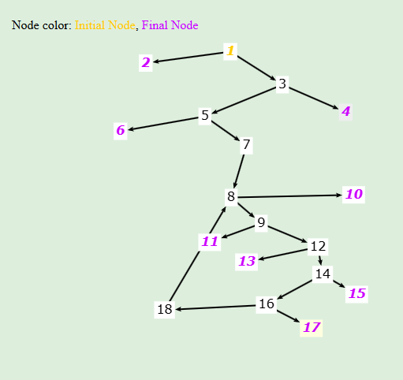

# Testing Report for FastCSV

## SWENG 881 Course Project

## Authors:

- Santhosh Anitha Boominathan
- Adam Slager

### Date: April 27, 2025

# Table of Contents

- [1. Introduction](#1-introduction)
  - [1.1 Test Project Name](#11-test-project-name)
  - [1.2 Summary of the Rest of the Test Plan](#12-summary-of-the-rest-of-the-test-plan)
- [2. Feature Description](#2-feature-description)
- [3. Assumptions](#3-assumptions)
  - [3.1 Test Case Exclusions](#31-test-case-exclusions)
  - [3.2 Test Tools, Formats, and Organizational Scheme](#32-test-tools-formats-and-organizational-scheme)
    - [3.2.1 Test Tools](#321-test-tools)
    - [3.2.2 Test Formats](#322-test-formats)
    - [3.2.3 Organizational Scheme](#323-organizational-scheme)
- [4. Test Approach](#4-test-approach)
  - [4.1 Addressing Past Issues](#41-addressing-past-issues)
  - [4.2 Special Testing Considerations](#42-special-testing-considerations)
  - [4.3 Test Strategy](#43-test-strategy)
  - [4.4 Test Categories](#44-test-categories)
- [5. Test Cases](#5-test-cases)
  - [5.1 Test Group Definition](#51-test-group-definition)
  - [5.2 Test Cases](#52-test-cases)
    - [5.2.1 Input Domain Modeling Test Cases](#521-input-domain-modeling-test-cases)
      - [5.2.1.1 CSVWriter IDM Test Cases](#5211-csvwriter-idm-test-cases)
      - [5.2.1.2 CSVReader IDM Test Cases](#5212-csvreader-idm-test-cases)
    - [5.2.2 Graph Based Test Cases](#522-graph-based-test-cases)
      - [5.2.2.1 CsvReader Graph Based Test Cases](#5221-csvreader-graph-based-test-cases)
      - [5.2.2.2 CsvWriter Graph Based Test Cases](#5222-csvwriter-graph-based-test-cases)
    - [5.2.3 Exploratory Test Cases](#523-exploratory-test-cases)
      - [5.2.3.1 Back Alley Tour - Part I](#5231-back-alley-tour---part-i)
      - [5.2.3.2 Back Alley Tour - Part II](#5232-back-alley-tour---part-ii)
      - [5.2.3.3 Collector's Tour Report](#5233-collectors-tour-report)
      - [5.2.3.4 FedEx Tour Report](#5234-fedex-tour-report)
      - [5.2.3.5 Intellectual Tour](#5235-intellectual-tour)
      - [5.2.3.6 Landmark Tour](#5236-landmark-tour)
    - [5.2.4 Acceptance Test Cases](#524-acceptance-testing-cases)
      - [5.2.4.1 CSVReader Acceptance Test Cases](#5241-csvreader-acceptance-test-cases)
      - [5.2.4.2 CSVWriter Acceptance Test Case](#5242-csvwriter-acceptance-test-case)
  - [5.3 Traceability Matrix](#53-traceability-matrix)
- [6. Test Environment](#6-test-environment)
  - [6.1 Multiple Test Environments](#61-multiple-test-environments)
  - [6.2 Schematic Diagram](#62-schematic-diagram)
  - [6.3 Test Architecture Overview](#63-test-architecture-overview)
  - [6.4 Equipment Table](#64-equipment-table)
- [7. Testing Results](#7-testing-results)
- [8. Recommendations on Software Quality](#8-recommendations-on-software-quality)

# 1. Introduction

## 1.1 Test Project Name

**Software Name:** FastCSV

**Software Github Repo:** [https://github.com/osiegmar/FastCSV](https://github.com/osiegmar/FastCSV)

**Software Website:** [https://fastcsv.org/](https://fastcsv.org/)

## 1.2 Summary of the Rest of the Test Plan

The following is a brief description of the remaining portions of the testing report.

- **Feature Description:** This section provides a high-level overview of the primary features of FastCSV. The purpose of this section is to educate the reader on the software and to provide a detailed description of the team’s assessment of its primary functionality. This section serves both as an introduction to the software and as a reference for the testing described in the remainder of the document.
- **Assumptions:** This section serves two primary purposes. Firstly, it lays out the team’s reasoning for excluding certain features and requirements of the software from the testing plan. This section can be crucial, as it serves to memorialize the logic around the exclusions and to provide the reader with a roadmap of any additional testing that might be required to get comfort over their particular usage of the software. Secondly, it describes the tools utilized during the testing and details pertinent organization structures utilized to describe the testing in the remainder of the document.
- **Test Approach:** The primary purpose of this section is to document the team’s test strategy and the reasoning behind choosing these approaches, including any special situations that might fall outside of the general approach. This section also lays out any past issues that are pertinent to our testing, which in the case of a mature application like FastCSV are generally minimal and well-documented. Finally, this section outlines the categories of tests cases for the software.
- **Test Cases:** This section serves to categorize and document the specific tests that were performed. It also details the organization structure of the test cases and provides a traceability matrix to tie the tests into the specific software requirements.
- **Test Environment:** The purpose of this section is to describe the specifics around the test environment, both in terms of the hardware used in testing and the organization of the software environment. A primary purpose of this section is to enhance the reproducibility of the tests by specifying this aforementioned information.
- **Testing Results:** This section serves as a running log of the results of each test performed, including their status and any observations made during the testing.
- **Recommendations on Software Quality:** This section provides the team’s assessment of the quality of the software along with any recommendations for potential improvements.

# 2. Feature Description

Per the official FastCSV website, “FastCSV is a high-performance CSV parser and writer for Java.” The functionality of the system can be logically bifurcated into those features belonging to each of the CsvReader and CsvWriter classes. The website and related documentation outline the features and design goals of the software; however, based on the team’s exploration of the documentation and our own use of the software, the team believes that the following are the primary features of these classes.

- **CsvReader**

  - **Standard Functionality:** Ability to read standard, comma separated values from a file.

  - **Configuration Ability** - Ability to configure the reading of the values via the following options:

    - **Field Separator** - A field separator denotes the character used to logically delineate between the fields of data in the file. While the program defaults to utilizing commas, it provides the user with the option to select another field separator. For example, a user may wish to read in a file that is separated by semi-colons instead.
    - **Quote Character** – Using quote characters allows the parser to treat the data between the quote characters as a single field, even if it contains a field separator. For example, the user might want to read in a CSV field, which contains commas. In this case, the program defaults to allowing the user to surround that field with quotes, such as “ice cream, cake, and candy.” In this case, that phrase would be read in as a single field, excluding the quotation marks. In some instances, though, the user may wish to designate a different character to represent quotation marks, such as when the fields in a file contain lots of quotes. The user may therefore specify another character to use, such as a percentage sign. In this case %”ice cream, cake, and candy”% would be read in as a single field, including the quotation marks.
    - **Different Field Counts** – The program allows the user to set a configuration option that either enforces or does not enforce adherence to consistent field counts. For example, a csv file may have a first row with two columns (fields) and a second row with 3 columns. Depending on the user’s requirements, they may wish for the program to read this with no issue or to throw an exception. The program defaults to not enforcing this adherence, meaning that the CSV files may have varying numbers of columns per row.
    - **BOM Headers** – Certain programs, such as Microsoft Excel, generate CSV files that begin with a BOM (Byte Order Mark) header. Per the FastCSV website, the purpose of a BOM Header was originally to designate the encoding of the file, although now it is largely unnecessary, as almost all CSV files utilize UTF-8. The program provides the user with functionality to either detect (and ignore) the BOM header, which is useful if the file has a BOM header and the user does not want this to be included in their data, or to not detect the BOM header, which is the default behavior.
    - **Comments** – Certain CSV files may contain comments, which are often designated by a character, such as ‘#.’ FastCSV allows users to customize how the program handles these comments, by selecting a custom comment designator and by specifying whether comments should be skipped by the reader or read in as a field. For example, suppose the user processes a CSV file that has multiple comments that begin with '!' and the user does not want these comments to appear in their parsed data. The user can specify that any lines beginning with '!' should be skipped. They would designate the comment character and the comment behavior separately. The program defaults to '#' as the comment character and not skipping comments as the behavior.
    - **Empty Lines** – Certain CSV files may contain empty lines. By default, the program is configured to skip these empty lines (i.e. not read them in). Alternatively, if the user wishes to read these empty lines in as blank fields, the user can configure the program to do so.

  - **Advanced Capabilities** - Ability to handle the following less common situations:

    - **Indexing CSV files** – Provides the user with the option to read a large CSV file, while designating how many records belong on each “page” of the file. Once the file is initially parsed, the user can quickly access any individual page of the file without having to parse the file again. This can save substantial amounts of time if the user needs to access a certain page (for instance, paginated web data).
    - **Field Modification** – Provides the user with the ability to modify fields as they are being read. A common use case for this is trimming or stripping leading or trailing blank characters from a field, if applicable.
    - **Reading Compressed CSV files** – The program allows the user to read CSV files that were compressed using the gzip format. The program handles the extraction process and then reads the files in as if they were not compressed.
    - **Ability to Automatically Map to Java Beans** – Allows the user to configure the program to map the CSV data that is read directly into Java Beans, with minimal performance penalty.

- **CsvWriter**

  - **Core Functionalities**

    - **Write CSV Records:** Supports writing CSV records from arrays of strings or other data types. Fields are automatically separated using a configurable separator character and optionally quoted.
    - **Line Delimiter Configuration:** Allows setting the line-ending strategy (e.g., CR, LF, CRLF, or platform-specific), supporting cross-platform compatibility.
    - **Field Quoting and Escaping:** Provides a flexible mechanism for quoting fields that contain special characters. Escaping strategies can be applied to prevent misinterpretation of field separators, quotes, or newline characters.

  - **Customization Options**

    - **Field Separator:** The default separator is a comma (`,`), but this can be replaced with other characters such as semicolons (`;`), tabs (`\t`), or pipes (`|`) based on user needs.
    - **Quote Character:** Users can configure which character is used to quote fields. The default is the double-quote (`"`), but alternative characters such as the single-quote (`'`) can be specified.
    - **Quote Strategy:** FastCSV supports multiple quote strategies through the `QuoteStrategy` interface. Examples include:
      - Always quote all fields.
      - Quote only when necessary (e.g., if the field contains the separator or quote character).
      - Never quote (if fields are guaranteed to be safe).
    - **Escape Mechanism:** When quoting is enabled and a field contains the quote character itself, the character is duplicated to escape it. For example, the value `5" screw` becomes `"5"" screw"` in the CSV output.

  - **Advanced Capabilities**

    - **Comment Writing:** Supports writing comments into the CSV using a specified comment character (e.g., `#`). Comments appear as standalone lines in the output.
    - **Null and Empty Value Handling:** Allows configuration on whether `null` or empty strings should be written as blank fields, quoted empty fields (`""`), or omitted entirely.
    - **Buffer Management:** Internally buffered writing supports large-scale output without performance bottlenecks.
    - **Output Stream and Writer Support:** Users can direct output to various destinations, including files, network sockets, or in-memory buffers through Java’s `OutputStream` or `Writer` interfaces.
    - **Auto-Flushing:** Configurable behavior to control whether data should be flushed to the output stream automatically after each record.

  - **Edge Case Handling**
    - **Handling Embedded Newlines:** If a field includes a newline character (`\n` or `\r\n`), quoting ensures the record remains syntactically correct.
    - **Control Character Restrictions:** FastCSV enforces that the field separator, quote character, and comment character must all be distinct and must not be newline characters.
    - **Exception Safety:** Provides safeguards through exceptions for illegal states, such as unclosed records or invalid configurations (e.g., duplicate control characters).

# 3. Assumptions

## 3.1 Test Case Exclusions

FastCSV is a mature and feature-heavy library for reading and writing CSVs. Since its initial release in 2015, a significant amount of additional functionality has been added. The team began the project by thoroughly reviewing FastCSV’s documentation, including the detailed instructions and tutorials outlined on their website. It quickly became clear that, due to time constraints, the team would have to adopt a testing approach that thoroughly tested the primary uses of the software (based on the team’s independent research and internal discussions), while deemphasizing or even excluding certain scenarios from our testing.

**Based our personal knowledge, independent research, and the description in the FastCSV documentation, the team decided that their testing would exclude the following functionality:**


- **CSVWriterBuilder Customization Edge Cases**  
  Scenarios involving non-default encodings, exotic delimiters, or extreme buffer configurations were not explored. These represent valid edge conditions but were deprioritized due to time constraints and low relevance to core functionality validation.
  - **CsvReader Customization Parameters**  
  The following CsvReader configuration settings were excluded due to time constraints and the team's evaluation of their priority:
  - `acceptingCharsAfterQuotes`: This affects how CsvReader tolerates unexpected characters after closing quotes.
  - `maxBufferSize`: Affects reader-side performance and limits during input processing.
- **Custom Callback Handlers**  
  The team excluded Custom Callback Handlers, which allow custom control over the reading of records, due to the team's evaluation of their usage potential and time constraints.
- **Error Handling for File System Failures**  
  Test cases involving low-level I/O errors (e.g., disk full, permission denied, file locks) were deprioritized as they pertain to Java’s standard file I/O mechanisms, not the logic of the program. These conditions are better suited for integration or system-level testing environments.
- **CSVWriter Exceptions for Invalid Configurations**
  Testing of exceptions for certain invalid configurations (e.g., overlapping control characters) were excluded from testing due to time constraints
- **Auto-Flushing:**
  Test cases involving auto-flushing were excluded, due to the team's evaluation of their usage potential and time constraints.

No other exclusions were identified during test planning or execution.

## 3.2 Test Tools, Formats, and Organizational Scheme

### 3.2.1 Test Tools

The full list of test tools utilized are listed in [Section 4.3](#43-test-strategy), as related to testing strategy, and [Section 6](#6-test-environment), as related to the overall test environment. The following, however, serves as an introduction to the tools used along with the reasoning behind their usage.

- **IntelliJ IDEA Community Edition** – a robustly featured IDE developed and owned by JetBrains. While the Community Edition has fewer features than the full edition, it is still very robust and more than capable for the scope of this project. Since FastCSV is written in Java, Adam decided to utilize IntelliJ as the IDE for testing. This was selected for several reasons:
  - Adam has experience using IntelliJ, so there would be little to no learning curve
  - The other testing tools utilized (namely, JUnit and Cucumber) are known to work well with IntelliJ IDEA and Adam has experience using these tools in conjunction with IntelliJ IDEA.
  - IntelliJ IDEA is one of the most popular and supported Java IDEs on the market.
- **Visual Studio Code (VSCode)** – the primary IDE used by Santhosh for all test implementation and documentation tasks. VSCode provided strong support for Java development, CSV file inspection, and markdown editing. Its lightweight interface and extensibility through extensions like Java Language Support, Markdown Preview, and Git integration made it the central tool for development, testing, and reporting.
- **JUnit** – an open-source testing framework that is widely used in industry and academia. It uses a combination of assertions and annotations to organize and automate testing. This was selected due to its popularity and the team’s experience in using JUnit for testing.
- **Mockito** - an open-source framework that integrates with Java and allows the tester to mock objects to simulate desired behavior from the mocked methods.  The team specifically used Mockito to throw IOExceptions when performing Graph Based Testing for the CSVReader in [Section 5.2.2.1](#5221-csvreader-graph-based-test-cases)

- **Cucumber** –an open-source framework that allows for acceptance test criteria to be written in a natural language that both technical and non-technical stakeholders can understand. Cucumber utilizes .feature files to write these plain language tests, which are then directly linked to the Java code and JUnit tests that actually test the code. The team selected Cucumber due to their experience using it and the simplicity of implementation.

### 3.2.2 Test Formats

The testing formats utilized generally parallel those that were covered in the course. These are explained in more detail, including the rational for choosing them, in [Section 4.3](#43-test-strategy). The individual test formats are also explained in great detail in [Section 5.2](#52-test-cases), alongside the test cases.

### 3.2.3 Organizational Scheme

Several organizational conventions were utilized when developing this testing document:

**Unique Identifiers**

- **Unique Test Identification**: In order to facilitate traceability, all test cases were assigned a unique identifier in the following format: `111-2-33` where:
  - `111` represents a three-letter code designating the type of testing that was performed
    - `IDM`: input domain modeling
    - `GBT`: graph based testing
    - `EXP`: exploratory testing
    - `ACC`: acceptance testing
  - `2` represents a one or two character abbreviation for a subcategory of test
    - `W`: a test that targets the CSVWriter functionality
    - `R`: a test that targets the CSVReader functionality
    - `B`: an exploratory test that is part of the Back Alley Tour
    - `C`: an exploratory test that is part of the Collector’s Tour
    - `F`: an exploratory test that is part of the FedEx Tour
    - `I`: an exploratory test that is part of the Intellectual Tour
    - `L`: an exploratory test that is part of the Landmark Tour
  - `33`: represents the unique test number that is part of the preceding categorizations.
- **Unique Requirement Identifiers**
  - Requirements targeting the CSVWriter functionality are formatted with REQ-W-XX where XX represents the requirement number
  - Requirements targeting the CSVReader functionality are formatted with REQ-R-XX where XX represents the requirement number
- **Unique Block Identifiers** - For Input Domain Testing, each input variable is partitioned into blocks. Those blocks are uniquely numbered with a character representing the input variable and a number representing the partition number.

**GitHub Structure**

Additionally, GitHub is being used to organize all files related to testing. The GitHub folder structure is as follows:

```
ProjectRoot/
├── AcceptanceTesting/ ← Files related to Acceptance Testing
|   ├── Images/ ← Screenshots supporting acceptance tests
│   └── Tests/ ← .java and .feature files
├── ExploratoryTesting/ ← Files related to Exploratory Testing
|   ├── CsvTestFiles/ ← Input/output CSV files
|   ├── Images/ ← Images from exploratory sessions
│   └── Tests/ ← Exploratory .java test scripts
├── GraphBasedTesting/ ← Files related to Graph-Based Testing
|   ├── CsvTestFiles/ ← Input files in CSV format
|   ├── Images/ ← Screenshots support GBT and rendered graph images
|   ├── ImageUMLs/ ← PlantUML source files for graphs
│   └── Tests/ ← Graph-based .java test cases
├── Images/ ← Images unrelated to testing group
└── InputDomainModeling/ ← Files related to Input Domain Modeling
    ├── CsvTestFiles/ ← Input/output CSV files
    ├── Images/ ← Screenshots supporting IDM tests
    └── Tests/ ← IDM .java test scripts
```

# 4. Test Approach

## 4.1 Addressing Past Issues

As described in [Section 3.1](#31-test-case-exclusions), FastCSV is mature software, that was first released in 2015. Since then, the application has been widely used and issues/defects have been reported and tracked in the Issues section of the project’s GitHub repository. The team reviewed the Issues section of the repository and it appears to be actively monitored and curated by the developer, with any issues being addressed and closed out, as appropriate. In some cases, the issue was remedied via a new version of the software being released and in other cases, the issue was deemed out of scope for the software. Additionally, the Issues section has been used to make feature suggestions or to request help using the software. As of the date of this document, all open issues have been marked as cleared. Due to the above, the team has decided that past issues or defects will not have a notable impact on our testing strategy.

## 4.2 Special Testing Considerations

The team has noted the following special considerations when developing our testing plan:

- As previously described, FastCSV is a Java library and not a standalone program. Therefore, instead of focusing on interactions via a user interface, the team will be able to narrow the testing focus and perform deeper tests on the many configuration options of the library.
- FastCSV has extensive documentation, and the domain of CSV file reading and writing is well documented and unambiguous. This removes much of the uncertainty about the intended performance of the program and therefore allows the team to write tests with confidence around the intended outcomes.
- As stated previously, the maturity level of the software and the active involvement of the developer decreases the likelihood of the team finding any major errors when performing the tests. While this will not alter our testing plan significantly, it is important to note while interpreting the results.
- The code around the software has been refactored and enhanced for over a decade and the developer has utilized advanced object-oriented concepts and Java features to streamline performance. The team recognizes that object-oriented complexity and testability are often inversely related and will consider this when developing tests.

## 4.3 Test Strategy

There are two primary parts of FastCSV: CSVReader and CSVWriter. Both parts have deep functionality, with multiple uses and customization options (as described previously in [Section 2](#2-feature-description)). The team decided to apply various testing strategies across both parts of the software, to diversify testing and maximize coverage, while strategically targeting the most common uses of the software.

CSV files are commonly used as an application-agnostic format to transfer information between spreadsheets, from spreadsheets to other applications, or between non-spreadsheet applications. One of the authors has extensive experience in the finance industry and has seen CSV files used to transfer information between spreadsheets and general ledger, banking, and specialty subledger systems. These files are most commonly formatted with a consistent number of columns between rows, with values separated by commas, and with no extraneous comments or blank rows. When designing and planning our testing approach, the team decided to focus predominantly on this most common usage, while also ensuring that edge case CSV format and program functionality was covered.

The following are the testing techniques that were utilized, along with a description of how the testing was performed:

### Strategic Objectives

Our testing approach was designed with the following core objectives:

- **Validate correctness** across representative and boundary inputs.
- **Uncover faults** in control logic and branching behaviors.
- **Expose risks** associated with real-world file formats and data irregularities.
- **Ensure confidence** that key use cases function as intended for end-users.

### Testing Technique Overview

**Input Domain Modeling**

Per the Canvas module, Input Domain Modeling involves partitioning each parameter of a function into blocks of logically related input values and then testing a value from each of the blocks. In the case of CSVReader and CSVWriter, a selection of input variables were chosen as the target parameters that were then partioned and tested. More about the variables, the chosen coverage criteria, and the selected tests can be found in [Section 5.2](#52-test-cases) below.

Input Domain Modeling was chosen to test CSVReader and CSVWriter methods as this technique prioritized **core functionality** and **high-impact configuration combinations**, based on:

- Realistic usage patterns (e.g., comma vs. semicolon separators)
- Documented edge behavior (e.g., nulls, embedded quotes/newlines)
- Risk of data corruption (e.g., malformed quoting logic)

Additional reasons for selecting Input Domain Modeling are as follows:
- Using Input Domain Modeling on these higher-level components provides the team with an opportunity to understand the major functionality of FastCSV early in the testing process. This understanding will assist in designing subsequent tests.
- Since FastCSV is already in production and the primary functionality is fully operational, testing at this level is a practical option at this early stage in the testing process. If this were an early sprint in an Agile project, this level of testing might not be available, since the functionality would not be fully developed.
- The components, and in particular the csv files themselves, are good targets for Input Domain Testing. The input domain of the csv files is practically infinite, but those possibilities can be logically partitioned into blocks representing both common use cases and edge cases. This allowed the team to develop a manageable framework for testing a large input space.

JUnit was utilized to test both CSVReader and CSVWriter.

**Graph Based Testing**

For logic-heavy methods like `skipLines(Predicate, int)` and `writeRecord(...)`, we abstracted their behavior into Control Flow Graphs (CFGs) for our graph based testing. CFGs are used to abstract the flow of a section code into a graph in order to design tests based on that abstraction. CFGs provide a visual representation of often complex functionality. Once the graph is created, it allows for generating test cases that ensure coverage of a the nodes and edges of the CFG in varying combinations of traversal. The team selected edge coverage for our criteria since, per the Canvas module, it ensures "that each edge is traversed at least once."

More specifically, the team utilized Graph Based Testing for :

- Testing complex branching or nested decision structures
- Mitigating the risk of silent failure (e.g., skipping incorrect lines, misplacing delimiters)
- Validating proper exception throwing on invalid or edge input

JUnit was utilized to test both methods. [PlantUML](https://plantuml.com) was used to design the CFGs. The [Graph Coverage web application](https://cs.gmu.edu:8443/offutt/coverage/GraphCoverage) was utilized to further abstract the CFG into a standardized number node format. Mockito was used to mock `IOException` throws for CSVReader.

**Exploratory Testing**

Exploratory testing is a less rigid approach to testing that can be utilized to augment traditional testing approaches. The team’s exploratory tests began with defining “tours,” which, per the class slides, are “recommended testing charters.” By reviewing the listing of predefined tours, the team was able to brainstorm appropriate tests that were not fully covered by the previous testing.

The tour themes were chosen based on:

- Risk analysis (volume handling, system tolerance)
- Uncovered feature areas (e.g., BOM headers, whitespace, quote control)
- Past issue reports or common misuse patterns

Once a tour and a feature of the program was chosen, the team began to plan out the tests associated with the tour and determine a time limit of the testing session that was appropriate, given the nature of the tests. Throughout the process, the team captured appropriate information (screen shots, test files, test scripts, etc.) to ensure that the process was repeatable.

As mentioned above, the team generally used exploratory testing as a chance to supplement the tests conducted in the previous sections, including lesser used features and other types of testing, such as stress tests and testing on data ordering, flow, and enumeration. The team utilized exploratory testing to achieve additional comfort over the quality of the system, given the time constraints surrounding the project. The guidance of the tour definitions also steered our testing in directions that we may not have considered without utilizing exploratory testing.

Generally, exploratory testing was performed in the IDE, using no additional tools. For several of the tests, however, Junit was utilized, as well.

**Acceptance Testing**

The team employed acceptance testing to validate the system’s behavior against end-user expectations and to ensure that key functionalities met specified requirements. Acceptance criteria were written using the Given–When–Then format and implemented using the Cucumber framework in conjunction with JUnit 5. The focus was on expressing high-level user stories in natural language to bridge the communication gap between technical and non-technical stakeholders.

Each acceptance test scenario was linked directly to its corresponding feature implementation, allowing for automated verification of expected outcomes. These tests served both as a validation mechanism and as living documentation of the system’s behavior. The acceptance tests primarily targeted high-value use cases within the CSVWriter component, ensuring that output formatting, quoting behavior, and error handling conformed to user expectations.

The tests were executed within the IntelliJ and VSCode IDEs, and results were verified through the Cucumber test runner interface. 

The acceptance tests validated end-to-end behavior, particularly:

- File writing integrity (`ACC-W-01`)
- Alternate separator handling (`ACC-R-01`)
- Quoted data parsing (`ACC-R-02`)included within the test documentation.

These tests served as **living documentation** and **user-aligned validation checkpoints**, selected based on frequently encountered CSV formats and expected user flows.

**Prioritization and Coverage Strategy**

The prioritization of features and test types was guided by:

- **Feature criticality** (e.g., `writeRecord` vs. comment writing)
- **Usage frequency and industry relevance**
- **Complexity and likelihood of fault** (e.g., line delimiters, quoting edge cases)
- **Effort-to-value ratio** under project constraints

Robustness was embedded into each category by including:

- **Special value cases** (e.g., `null`, empty, quoted)
- **Malformed input** triggering exceptions
- **Invalid configuration tests** (e.g., duplicate control characters)

## 4.4 Test Categories

All of the tests that the team performed for FastCSV were functional. The functionality for the software is deep and highly configurable, so the team planned to focus the testing on this functionality.

Several of our tests also covered non-functional categories, though, as described in Section 4.2 of the Canvas Module:

- **Robustness Tests** – Many of our tests also met the definition of Boundary Value tests.
  - **System Defaults** - Per the Canvas module, boundary tests can target default values. FastCSV is configured with many default values that represent the most common use case of the system. The majority of the tests conducted by the team include at least one or more configuration options that remain at their default values. While this category is noted, the team has decided to *not* utilize System Defaults as an additional classification for the tests, since all tests would be labeled as such providing little additional value.
  - **Special Values** – Many of the team’s tests include testing edge cases or special values to ensure that they are handled properly by the system. For example, some tests in the Input Domain Modeling section test how the system handles special characters, commas used as data (these are also used as field separators), etc.
  - **Invalid Data** – Several of the tests involve providing invalid data (including data that should correctly throw errors) to the System and ensuring that the System handles the error gracefully.
- **Performance Tests** – As part of our exploratory testing, the team tested the performance of the System while reading exceptionally large csv files.
- **Stress Tests** – The same tests that were used to test performance were also targeted at trying to cause a failure by reading exceptionally large csv files.

Given the above, the team will classify tests using the following categories:

- **Functional**
- **Robustness-Special Values ("Spec Val")**
- **Robustness-Invalid Data ("Invalid Data")**
- **Performance ("Perf")**
- **Stress**

Refer to [Section 7](#7-testing-results) below for a complete list of Tests, Categories, and Results.

# 5. Test Cases

## 5.1 Test Group Definition

The team's organization of test cases into groups and subgroups mirrors the organization of the test case numbering pattern, as described in [Section 3.2](#32-test-tools-formats-and-organizational-scheme). The tests are divided into four distinct testing groups, one for each type of testing performed:

| Group                 | Objective                                                                                                                                                                                                                                                                                                                  |
| --------------------- | -------------------------------------------------------------------------------------------------------------------------------------------------------------------------------------------------------------------------------------------------------------------------------------------------------------------------- |
| Input Domain Modeling ("IDM")| To ensure that the primary functionality of the two major features of the system match the expectations set forth in the requirements by segmenting inputs into blocks of related possible values and selecting tests values from those blocks in order to efficiently achieve coverage of a wide variety of input values. |
| Graph Based Testing ("GBT")  | To test the branching paths of code and ensure that all possible paths match the expected results set forth in the requirements by abstracting the code into graphs and designing test cases to cover the edges of the graphs                                                                                              |
| Exploratory Testing ("EXP")  | To cover areas not thoroughly tested in the previous methodologies by utilizing timed sessions and tester creativity within the confines of predefined test charters to ensure the system meets its requirements through developing and executing less formalized ad hoc tests.                                            |
| Acceptance Testing ("ACC")   | To test the system from the perspective of the end user by developing natural language acceptance criteria for user stories and linking coded tests to the criteria, helping to bridge the gap between technical testing and domain knowledge.                                                                              |

Each of the main groups is further broken into subgroups:

| Subgroup     | Parent Group(s)                                                    | Objective                                                                                        |
| ------------ | ------------------------------------------------------------------ | ------------------------------------------------------------------------------------------------ |
| CSVWriter    | Input Domain Modeling<br>Graph Based Testing<br>Acceptance Testing | To test the functionality of the CSVWriter feature                                               |
| CSVReader    | Input Domain Modeling<br>Graph Based Testing<br>Acceptance Testing | To test the functionality of the CSVReader feature                                               |
| Back Alley   | Exploratory Testing                                                | To test less common features of the software                                                     |
| Collector’s  | Exploratory Testing                                                | To exhaustively test output variation handling using nulls, empty fields, quotes, and newlines   |
| FedEx        | Exploratory Testing                                                | To verify data integrity and formatting during structured record writing across systems          |
| Intellectual | Exploratory Testing                                                | To test the robustness of the software while handling large sets of data                         |
| Landmark     | Exploratory Testing                                                | To verify the interaction of key writer features (quoting, separators, line endings) in sequence |

Note: The definition for the tours in the above table were adapted from the Canvas module.

By examining each test case number, the reader can clearly determine both the category and subcategory of the test case. For example, test IDM-W-01 is category Input Domain Modeling and subcategory Writer. Test case EXP-C-02 is category Exploratory Tour and subcategory Collector's Tour. The test case identifier schema is defined in [Section 3.2](#32-test-tools-formats-and-organizational-scheme).

## 5.2 Test Cases

The following chart lists the test cases, along with their test category, group, and subgroup.

| Test ID  | Categories              | Group                 | Subgroup     | Test Section                                      |
| -------- | ----------------------- | --------------------- | ------------ | ------------------------------------------------- |
| IDM-R-01 | Functional              | Input Domain Modeling | CSVReader    | [5.2.1.2](#5212-csvreader-idm-test-cases)         |
| IDM-R-02 | Functional/Spec Val     | Input Domain Modeling | CSVReader    | [5.2.1.2](#5212-csvreader-idm-test-cases)         |
| IDM-R-03 | Functional              | Input Domain Modeling | CSVReader    | [5.2.1.2](#5212-csvreader-idm-test-cases)         |
| IDM-R-04 | Functional              | Input Domain Modeling | CSVReader    | [5.2.1.2](#5212-csvreader-idm-test-cases)         |
| IDM-R-05 | Functional/Stress       | Input Domain Modeling | CSVReader    | [5.2.1.2](#5212-csvreader-idm-test-cases)         |
| IDM-R-06 | Functional/Spec Val     | Input Domain Modeling | CSVReader    | [5.2.1.2](#5212-csvreader-idm-test-cases)         |
| IDM-R-07 | Functional/Spec Val     | Input Domain Modeling | CSVReader    | [5.2.1.2](#5212-csvreader-idm-test-cases)         |
| IDM-R-08 | Functional              | Input Domain Modeling | CSVReader    | [5.2.1.2](#5212-csvreader-idm-test-cases)         |
| IDM-R-09 | Functional              | Input Domain Modeling | CSVReader    | [5.2.1.2](#5212-csvreader-idm-test-cases)         |
| IDM-R-10 | Functional/Spec Val     | Input Domain Modeling | CSVReader    | [5.2.1.2](#5212-csvreader-idm-test-cases)         |
| IDM-R-11 | Functional              | Input Domain Modeling | CSVReader    | [5.2.1.2](#5212-csvreader-idm-test-cases)         |
| IDM-R-12 | Functional              | Input Domain Modeling | CSVReader    | [5.2.1.2](#5212-csvreader-idm-test-cases)         |
| IDM-R-13 | Functional              | Input Domain Modeling | CSVReader    | [5.2.1.2](#5212-csvreader-idm-test-cases)         |
| IDM-R-14 | Functional              | Input Domain Modeling | CSVReader    | [5.2.1.2](#5212-csvreader-idm-test-cases)         |
| IDM-R-15 | Functional              | Input Domain Modeling | CSVReader    | [5.2.1.2](#5212-csvreader-idm-test-cases)         |
| IDM-R-16 | Functional              | Input Domain Modeling | CSVReader    | [5.2.1.2](#5212-csvreader-idm-test-cases)         |
| IDM-R-17 | Functional/Invalid Data | Input Domain Modeling | CSVReader    | [5.2.1.2](#5212-csvreader-idm-test-cases)         |
| IDM-R-18 | Functional              | Input Domain Modeling | CSVReader    | [5.2.1.2](#5212-csvreader-idm-test-cases)         |
| IDM-W-01 | Functional              | Input Domain Modeling | CSVWriter    | [5.2.1.1](#5211-csvwriter-idm-test-cases)         |
| IDM-W-02 | Functional/Spec Val     | Input Domain Modeling | CSVWriter    | [5.2.1.1](#5211-csvwriter-idm-test-cases)         |
| IDM-W-03 | Functional/Spec Val     | Input Domain Modeling | CSVWriter    | [5.2.1.1](#5211-csvwriter-idm-test-cases)         |
| IDM-W-04 | Functional/Spec Val     | Input Domain Modeling | CSVWriter    | [5.2.1.1](#5211-csvwriter-idm-test-cases)         |
| IDM-W-05 | Functional              | Input Domain Modeling | CSVWriter    | [5.2.1.1](#5211-csvwriter-idm-test-cases)         |
| IDM-W-06 | Functional              | Input Domain Modeling | CSVWriter    | [5.2.1.1](#5211-csvwriter-idm-test-cases)         |
| IDM-W-07 | Functional              | Input Domain Modeling | CSVWriter    | [5.2.1.1](#5211-csvwriter-idm-test-cases)         |
| IDM-W-08 | Functional/Spec Val     | Input Domain Modeling | CSVWriter    | [5.2.1.1](#5211-csvwriter-idm-test-cases)         |
| GBT-W-01 | Functional/Spec Val     | Graph Based Testing   | CSVWriter    | [5.2.2.2](#5222-csvwriter-graph-based-test-cases) |
| GBT-W-02 | Functional/Spec Val     | Graph Based Testing   | CSVWriter    | [5.2.2.2](#5222-csvwriter-graph-based-test-cases) |
| GBT-W-03 | Functional/Spec Val     | Graph Based Testing   | CSVWriter    | [5.2.2.2](#5222-csvwriter-graph-based-test-cases) |
| GBT-W-04 | Functional              | Graph Based Testing   | CSVWriter    | [5.2.2.2](#5222-csvwriter-graph-based-test-cases) |
| GBT-W-05 | Functional/Spec Val     | Graph Based Testing   | CSVWriter    | [5.2.2.2](#5222-csvwriter-graph-based-test-cases) |
| GBT-R-01 | Functional              | Graph Based Testing   | CSVReader    | [5.2.2.1](#5221-csvreader-graph-based-test-cases) |
| GBT-R-02 | Functional              | Graph Based Testing   | CSVReader    | [5.2.2.1](#5221-csvreader-graph-based-test-cases) |
| GBT-R-03 | Functional/Invalid Data | Graph Based Testing   | CSVReader    | [5.2.2.1](#5221-csvreader-graph-based-test-cases) |
| GBT-R-04 | Functional/Invalid Data | Graph Based Testing   | CSVReader    | [5.2.2.1](#5221-csvreader-graph-based-test-cases) |
| GBT-R-05 | Functional              | Graph Based Testing   | CSVReader    | [5.2.2.1](#5221-csvreader-graph-based-test-cases) |
| GBT-R-06 | Functional/Invalid Data | Graph Based Testing   | CSVReader    | [5.2.2.1](#5221-csvreader-graph-based-test-cases) |
| GBT-R-07 | Functional/Invalid Data | Graph Based Testing   | CSVReader    | [5.2.2.1](#5221-csvreader-graph-based-test-cases) |
| GBT-R-08 | Functional/Invalid Data | Graph Based Testing   | CSVReader    | [5.2.2.1](#5221-csvreader-graph-based-test-cases) |
| GBT-R-09 | Functional/Invalid Data | Graph Based Testing   | CSVReader    | [5.2.2.1](#5221-csvreader-graph-based-test-cases) |
| EXP-B-01 | Functional              | Exploratory Testing   | Back Alley   | [5.2.3.1](#5231-back-alley-tour---part-i)         |
| EXP-B-02 | Functional/Stress       | Exploratory Testing   | Back Alley   | [5.2.3.1](#5231-back-alley-tour---part-i)         |
| EXP-B-03 | Functional              | Exploratory Testing   | Back Alley   | [5.2.3.1](#5231-back-alley-tour---part-i)         |
| EXP-B-04 | Functional/Stress/Perf  | Exploratory Testing   | Back Alley   | [5.2.3.1](#5231-back-alley-tour---part-i)         |
| EXP-B-05 | Functional              | Exploratory Testing   | Back Alley   | [5.2.3.2](#5232-back-alley-tour---part-ii)        |
| EXP-B-06 | Functional/Spec Val     | Exploratory Testing   | Back Alley   | [5.2.3.2](#5232-back-alley-tour---part-ii)        |
| EXP-B-07 | Functional/Spec Val     | Exploratory Testing   | Back Alley   | [5.2.3.2](#5232-back-alley-tour---part-ii)        |
| EXP-B-08 | Functional/Spec Val     | Exploratory Testing   | Back Alley   | [5.2.3.2](#5232-back-alley-tour---part-ii)        |
| EXP-B-09 | Functional              | Exploratory Testing   | Back Alley   | [5.2.3.2](#5232-back-alley-tour---part-ii)        |
| EXP-B-10 | Functional              | Exploratory Testing   | Back Alley   | [5.2.3.2](#5232-back-alley-tour---part-ii)        |
| EXP-C-01 | Functional              | Exploratory Testing   | Collector's  | [5.2.3.3](#5233-collectors-tour-report)           |
| EXP-C-02 | Functional              | Exploratory Testing   | Collector's  | [5.2.3.3](#5233-collectors-tour-report)           |
| EXP-C-03 | Functional              | Exploratory Testing   | Collector's  | [5.2.3.3](#5233-collectors-tour-report)           |
| EXP-C-04 | Functional              | Exploratory Testing   | Collector's  | [5.2.3.3](#5233-collectors-tour-report)           |
| EXP-C-05 | Functional              | Exploratory Testing   | Collector's  | [5.2.3.3](#5233-collectors-tour-report)           |
| EXP-C-06 | Functional              | Exploratory Testing   | Collector's  | [5.2.3.3](#5233-collectors-tour-report)           |
| EXP-F-01 | Functional              | Exploratory Testing   | Fedex        | [5.2.3.4](#5234-fedex-tour-report)                |
| EXP-F-02 | Functional              | Exploratory Testing   | Fedex        | [5.2.3.4](#5234-fedex-tour-report)                |
| EXP-F-03 | Functional              | Exploratory Testing   | Fedex        | [5.2.3.4](#5234-fedex-tour-report)                |
| EXP-F-04 | Functional              | Exploratory Testing   | Fedex        | [5.2.3.4](#5234-fedex-tour-report)                |
| EXP-F-05 | Functional              | Exploratory Testing   | Fedex        | [5.2.3.4](#5234-fedex-tour-report)                |
| EXP-F-06 | Functional              | Exploratory Testing   | Fedex        | [5.2.3.4](#5234-fedex-tour-report)                |
| EXP-I-01 | Functional/Stress/Perf  | Exploratory Testing   | Intellectual | [5.2.3.5](#5235-intellectual-tour)                |
| EXP-I-02 | Functional/Stress/Perf  | Exploratory Testing   | Intellectual | [5.2.3.5](#5235-intellectual-tour)                |
| EXP-I-03 | Functional/Stress/Perf  | Exploratory Testing   | Intellectual | [5.2.3.5](#5235-intellectual-tour)                |
| EXP-I-04 | Functional/Stress/Perf  | Exploratory Testing   | Intellectual | [5.2.3.5](#5235-intellectual-tour)                |
| EXP-L-01 | Functional              | Exploratory Testing   | Landmark     | [5.2.3.6](#5236-landmark-tour)                    |
| EXP-L-02 | Functional              | Exploratory Testing   | Landmark     | [5.2.3.6](#5236-landmark-tour)                    |
| EXP-L-03 | Functional              | Exploratory Testing   | Landmark     | [5.2.3.6](#5236-landmark-tour)                    |
| EXP-L-04 | Functional              | Exploratory Testing   | Landmark     | [5.2.3.6](#5236-landmark-tour)                    |
| EXP-L-05 | Functional              | Exploratory Testing   | Landmark     | [5.2.3.6](#5236-landmark-tour)                    |
| EXP-L-06 | Functional              | Exploratory Testing   | Landmark     | [5.2.3.6](#5236-landmark-tour)                    |
| ACC-R-01 | Functional/Spec Val     | Exploratory Testing   | Landmark     | [5.2.4.1](#5241-csvreader-acceptance-test-cases)  |
| ACC-R-02 | Functional/Spec Val     | Exploratory Testing   | Landmark     | [5.2.4.1](#5241-csvreader-acceptance-test-cases)  |
| ACC-W-01 | Functional              | Exploratory Testing   | Landmark     | [5.2.4.2](#5242-csvwriter-acceptance-test-case)   |


### 5.2.1 Input Domain Modeling Test Cases

#### **5.2.1.1 CSVWriter IDM Test Cases**

**Function Under Test:** `writeRecord(String... values)` in `CsvWriter`

This function takes a variable-length array of strings and writes them as a single CSV record. The writing behavior is controlled by configuration options such as field separator, quote strategy, quote character, and line delimiter. It is the core functionality of the CSVWriter component.

**List of Input Variables**

| Input Variable   | Description                                      | Default |
| ---------------- | ------------------------------------------------ | ------- |
| `values`         | An array of strings representing one CSV row.    | —       |
| `fieldSeparator` | Character used to separate fields in the output. | `,`     |
| `quoteCharacter` | Character used to enclose fields needing quotes. | `"`     |
| `quoteStrategy`  | Strategy to decide when fields are quoted.       | null    |
| `lineDelimiter`  | Type of line ending to use (`CRLF`, `LF`, etc.). | `CRLF`  |

**Characteristics of Input Variables**

| Variable         | Type            | Constraints                                               |
| ---------------- | --------------- | --------------------------------------------------------- |
| `values`         | `String[]`      | May include nulls, empty strings, or special characters.  |
| `fieldSeparator` | `char`          | Must not conflict with quote or newline characters.       |
| `quoteCharacter` | `char`          | Must be unique and not equal to separator or line breaks. |
| `quoteStrategy`  | `QuoteStrategy` | Can be null or strategy like `ALWAYS`, `NEVER`.           |
| `lineDelimiter`  | `LineDelimiter` | Must be one of: `CR`, `LF`, `CRLF`, `PLATFORM`.           |

**Partitioning Characteristics into Blocks**

| Input Variable   | Blocks                                    | Example Values                         | Related Tests                      |
| ---------------- | ----------------------------------------- | -------------------------------------- | ---------------------------------- |
| `values`         | block-a1: null values                     | `[null]`                               | IDM-W-02                           |
|                  | block-a2: empty strings                   | `[""]`                                 | IDM-W-03                           |
|                  | block-a3: regular strings                 | `["Alice", "30", "USA"]`               | IDM-W-01, IDM-W-05 to-07           |
|                  | block-a4: strings with commas, quotes, \n | `["x,y", "\"quoted\"", "line\nbreak"]` | IDM-W-04, IDM-W-08                 |
| `fieldSeparator` | block-b1: comma (default)                 | `','`                                  | IDM-W-01 to -04, IDM-W-06 to -08   |
|                  | block-b2: alternative                     | `';'`                                  | IDM-W-05                           |
| `quoteCharacter` | block-c1: double quote (default)          | `'"'`                                  | IDM-W-01 to -05, IDM-W-07/08       |
|                  | block-c2: single quote                    | `'\''`                                 | IDM-W-06                           |
| `quoteStrategy`  | block-d1: null (default behavior)         | `null`                                 | IDM-W-01, IDM-W-04 to 06, IDM-W-08 |
|                  | block-d2: always quote                    | `QuoteStrategies.ALWAYS`               | IDM-W-02, IDM-W-03, IDM-W-07       |
| `lineDelimiter`  | block-e1: CRLF                            | `LineDelimiter.CRLF`                   | IDM-W-01 to -07                    |
|                  | block-e2: LF                              | `LineDelimiter.LF`                     | IDM-W-08                           |

**Coverage Criteria**

We applied **Each-Choice Coverage**: every block of each input variable is covered in at least one test. This provides broad but efficient coverage of combinations without exhaustive enumeration.

**Test Descriptions**

Each test row (IDM-W-01, IDM-W-02, ...) targets specific block combinations of input variables. The values column in each test shows the concrete inputs used for that scenario.

| Test #   | Purpose Description                                                                          |
| -------- | -------------------------------------------------------------------------------------------- |
| IDM-W-01 | Baseline test for normal values with all default settings.                                   |
| IDM-W-02 | Verify handling of `null` values with a strategy that forces quoting.                        |
| IDM-W-03 | Ensure empty strings are correctly quoted under a forced quote strategy.                     |
| IDM-W-04 | Validate escaping of special characters like comma, quotes, and newlines.                    |
| IDM-W-05 | Test alternate field separator (`;`) with normal string values.                              |
| IDM-W-06 | Use a non-default quote character (`'`) and ensure output is consistent.                     |
| IDM-W-07 | Apply a quoting strategy that forces quotes on non-empty fields.                             |
| IDM-W-08 | Change line delimiter to `LF` and test output of a value with an embedded newline character. |

**Test Set Definition**

| Test#    | Description                               | `values`                               | `fieldSeparator` | `quoteCharacter` | `quoteStrategy`          | `lineDelimiter` | Covered Blocks     |
| -------- | ----------------------------------------- | -------------------------------------- | ---------------- | ---------------- | ------------------------ | --------------- | ------------------ |
| IDM-W-01 | Normal strings with default configuration | `["Alice", "30", "USA"]`               | `','`            | `'"'`            | `null`                   | `CRLF`          | a3, b1, c1, d1, e1 |
| IDM-W-02 | Null values with quote strategy always    | `[null, null, null]`                   | `','`            | `'"'`            | `QuoteStrategies.ALWAYS` | `CRLF`          | a1, b1, c1, d2, e1 |
| IDM-W-03 | Empty strings with quote strategy always  | `["", "", ""]`                         | `','`            | `'"'`            | `QuoteStrategies.ALWAYS` | `CRLF`          | a2, b1, c1, d2, e1 |
| IDM-W-04 | Strings with special characters           | `["x,y", "\"quoted\"", "line\nbreak"]` | `','`            | `'"'`            | `null`                   | `CRLF`          | a4, b1, c1, d1, e1 |
| IDM-W-05 | Alternate field separator                 | `["one", "two"]`                       | `';'`            | `'"'`            | `null`                   | `CRLF`          | a3, b2, c1, d1, e1 |
| IDM-W-06 | Alternate quote character                 | `["x", "y"]`                           | `','`            | `'\''`           | `null`                   | `CRLF`          | a3, b1, c2, d1, e1 |
| IDM-W-07 | Force quoting on normal data              | `["quoted"]`                           | `','`            | `'"'`            | `QuoteStrategies.ALWAYS` | `CRLF`          | a3, b1, c1, d2, e1 |
| IDM-W-08 | Use LF line endings with newline in value | `["line\nbreak"]`                      | `','`            | `'"'`            | `null`                   | `LF`            | a4, b1, c1, d1, e2 |

The below table shows an alternate view of the above. Each test number as columns (the "IDM-R-" prefix has been removed for formatting). Each tested input variable is listed in a row. The intersections show the specific block of the input variable that is being covered by a specific test.

| test # (prefix = IDM-W-) | 01  | 02  | 03  | 04  | 05  | 06  | 07  | 08  |
| ------------------------ | --- | --- | --- | --- | --- | --- | --- | --- |
| values                   | a3  | a1  | a2  | a4  | a3  | a3  | a3  | a4  |
| fieldSeparator           | b1  | b1  | b1  | b1  | b2  | b1  | b1  | b1  |
| quoteCharacter           | c1  | c1  | c1  | c1  | c1  | c2  | c1  | c1  |
| quoteStrategy            | d1  | d2  | d2  | d1  | d1  | d1  | d2  | d1  |
| lineDelimiter            | e1  | e1  | e1  | e1  | e1  | e1  | e1  | e2  |

The code for the tests can be found in [TestWriterIDM.java](InputDomainModeling/Tests/TestWriterIDM.java)

**Execution Results**
All IDM test cases for `CsvWriter` were executed using the `TestWriterIDM.java` class located under `/InputDomainModeling/Tests/`. Each test case wrote records to actual CSV files using `CsvWriter`, and the outputs were verified through file inspection using `Files.readAllLines(...)` or `Files.readString(...)`.

Test validations included:

- Structural correctness of CSV output (field order, quoting, separators)
- Correct application of `null` handling and empty field behavior
- Proper escaping of special characters such as commas, quotes, and newlines
- Verification of alternate separators, quote characters, and line delimiters

All tests passed successfully, confirming that the `CsvWriter` logic conforms to the expected behavior under each input domain partition.

Results were captured and are available in the following screenshot:

- [IDMWriterResults.png](/InputDomainModeling/Images/IDMWriterResults.png)

These results demonstrate that each input block and configuration path was exercised as intended and yielded expected output in terms of content, structure, and format.

**Test Execution Summary**

| Test ID  | Description                                             | Input Blocks       | Result Screenshot                                                        | Status |
| -------- | ------------------------------------------------------- | ------------------ | ------------------------------------------------------------------------ | ------ |
| IDM-W-01 | Normal strings with default configuration               | a3, b1, c1, d1, e1 | [IDMWriterResults.png](/InputDomainModeling/Images/IDMWriterResults.png) | Pass   |
| IDM-W-03 | Empty strings with quote strategy always                | a2, b1, c1, d2, e1 | [IDMWriterResults.png](/InputDomainModeling/Images/IDMWriterResults.png) | Pass   |
| IDM-W-04 | Special characters: commas, quotes, newlines            | a4, b1, c1, d2, e1 | [IDMWriterResults.png](/InputDomainModeling/Images/IDMWriterResults.png) | Pass   |
| IDM-W-05 | Alternate field separator (`;`)                         | a3, b2, c1, d1, e1 | [IDMWriterResults.png](/InputDomainModeling/Images/IDMWriterResults.png) | Pass   |
| IDM-W-06 | Alternate quote character (`'`)                         | a3, b1, c2, d1, e1 | [IDMWriterResults.png](/InputDomainModeling/Images/IDMWriterResults.png) | Pass   |
| IDM-W-07 | Always quote strategy applied to normal strings         | a3, b1, c1, d2, e1 | [IDMWriterResults.png](/InputDomainModeling/Images/IDMWriterResults.png) | Pass   |
| IDM-W-08 | Linefeed delimiter (`LF`) with newline-containing field | a4, b1, c1, d1, e2 | [IDMWriterResults.png](/InputDomainModeling/Images/IDMWriterResults.png) | Pass   |

#### **5.2.1.2 CSVReader IDM Test Cases**

**Selected Functions/Features for Input Domain Modeling**  
For the `CsvReader` component, the team selected the `ofCsvRecord(Path file)` method for testing with input domain modeling. This method is a high-level entry point for reading CSV files, leveraging the `CsvReaderBuilder` and `CsvParser` to process file input into `CsvRecord` objects. It’s a suitable choice as it encapsulates the full reading process and allows testing of file-based input handling.

**List of Input Variables**

| Input Variable              | Description                                                                     | Default Value |
| --------------------------- | ------------------------------------------------------------------------------- | ------------- |
| `file`                      | A `Path` object representing the CSV file to read.                              | —             |
| `fieldSeparator`            | A character defining the separator between fields.                              | `,`           |
| `quoteCharacter`            | A character used to enclose fields.                                             | `"`           |
| `commentStrategy`           | Determines how comment lines are handled.                                       | `NONE`        |
| `commentCharacter`          | Denotes the beginning of a comment line.                                        | `#`           |
| `ignoreDifferentFieldCount` | Controls whether to ignore malformed files with different field counts per row. | `true`        |
| `skipEmptyLines`            | Controls whether empty lines are skipped during parsing.                        | `true`        |
| `detectBomHeader`           | Controls whether to detect and skip BOM header in CSV file.                     | `false`       |

**Characteristics of Input Variables**

| Input Variable              | Type                   | Constraints                                     |
| --------------------------- | ---------------------- | ----------------------------------------------- |
| `file`                      | `Path`                 | Must point to a readable file; content can vary |
| `fieldSeparator`            | Single `char`          | Must not be a newline character.                |
| `quoteCharacter`            | Single `char`          | Must not be a newline character.                |
| `commentStrategy`           | `CommentStrategy` enum | Defines comment line behavior.                  |
| `commentCharacter`          | Single `char`          | Must not be a newline character.                |
| `ignoreDifferentFieldCount` | `boolean`              | `true` or `false`.                              |
| `skipEmptyLines`            | `boolean`              | `true` or `false`.                              |
| `detectBomHeader`           | `boolean`              | `true` or `false`.                              |

**Partitioning Characteristics into Blocks**

| Input Variable              | Blocks                                          | Values                                                                       | Related Tests       |
| --------------------------- | ----------------------------------------------- | ---------------------------------------------------------------------------- | ------------------- |
| `file`                      | Block a1: Valid CSV file of strings and numbers | [reader-file-a01.csv](/InputDomainModeling/CsvTestFiles/reader-file-a01.csv) | IDM-R-01            |
|                             | Block a2: CSV of special characters             | [reader-file-a02.csv](/InputDomainModeling/CsvTestFiles/reader-file-a02.csv) | IDM-R-02            |
|                             | Block a3: Single column CSV                     | [reader-file-a03.csv](/InputDomainModeling/CsvTestFiles/reader-file-a03.csv) | IDM-R-03            |
|                             | Block a4: Single row CSV                        | [reader-file-a04.csv](/InputDomainModeling/CsvTestFiles/reader-file-a04.csv) | IDM-R-04            |
|                             | Block a5: Very large CSV (1 million rows)       | reader-file-a05.csv (Excluded from GitHub due to size)                       | IDM-R-05            |
|                             | Block a6: CSV file with commas as data          | [reader-file-a06.csv](/InputDomainModeling/CsvTestFiles/reader-file-a06.csv) | IDM-R-06            |
|                             | Block a7: CSV file with quotes as data          | [reader-file-a07.csv](/InputDomainModeling/CsvTestFiles/reader-file-a07.csv) | IDM-R-07            |
|                             | Block a8: Uneven # of columns in rows           | [reader-file-a08.csv](/InputDomainModeling/CsvTestFiles/reader-file-a08.csv) | IDM-R-08, IDM-R-17  |
|                             | Block a9: Skipped Rows                          | [reader-file-a09.csv](/InputDomainModeling/CsvTestFiles/reader-file-a09.csv) | IDM-R-09, IDM-R-19  |
|                             | Block a10: Empty file                           | [reader-file-a10.csv](/InputDomainModeling/CsvTestFiles/reader-file-a10.csv) | IDM-R-10            |
|                             | Block a11: `';'` as field separator             | [reader-file-a11.csv](/InputDomainModeling/CsvTestFiles/reader-file-a11.csv) | IDM-R-11            |
|                             | Block a12: `'` as quotes                        | [reader-file-a12.csv](/InputDomainModeling/CsvTestFiles/reader-file-a12.csv) | IDM-R-12            |
|                             | Block a13: `#` as comments                      | [reader-file-a13.csv](/InputDomainModeling/CsvTestFiles/reader-file-a13.csv) | IDM-R-13, IDM-R-16  |
|                             | Block a14: `@` as comments                      | [reader-file-a14.csv](/InputDomainModeling/CsvTestFiles/reader-file-a14.csv) | IDM-R-14            |
|                             | Block a15: File with BOM header                 | [reader-file-a15.csv](/InputDomainModeling/CsvTestFiles/reader-file-a15.csv) | IDM-R-15            |
| `fieldSeparator`            | Block b1: Default                               | Defaults to `','`                                                            | all except IDM-R-11 |
|                             | Block b2: Alternative separator                 | `';'`                                                                        | IDM-R-11            |
| `quoteCharacter`            | Block c1: Default                               | Defaults to `'"'`                                                            | IDM-R-06, IDM-R-07  |
|                             | Block c2: Alternative quote                     | `'^'`                                                                        | IDM-R-12            |
| `commentStrategy`           | Block d1: Default                               | Defaults to `CommentStrategy.NONE`                                           | IDM-R-16            |
|                             | Block d2: `SKIP`                                | `CommentStrategy.SKIP`                                                       | IDM-R-13, IDM-R-14  |
| `commentCharacter`          | Block e1: Default                               | Defaults to `#`                                                              | IDM-R-13, IDM-R-16  |
|                             | Block e2: Alternate                             | `@`                                                                          | IDM-R-14            |
| `ignoreDifferentFieldCount` | Block f1: Default                               | Defaults to `true`                                                           | IDM-R-08            |
|                             | Block f2: `false`                               | `false`                                                                      | IDM-R-17            |
| `skipEmptyLines`            | Block g1: Default                               | Defaults to `true`                                                           | IDM-R-18            |
|                             | Block g2: `false`                               | `false`                                                                      | IDM-R-09            |
| `detectBomHeader`           | Block h1: Default                               | Defaults to 'false'                                                          | all except IDM-R-15 |
|                             | Block h2: `true`                                | `true`                                                                       | IDM-R-15            |

**Coverage Criteria**  
The "Each-Choice" coverage criterion was selected to ensure each block is tested at least once, providing broad coverage of file reading scenarios (e.g., valid input, edge cases) while keeping the test set manageable.

**Test Set Definition**<br>
The below table shows each test number as columns (the "IDM-R-" prefix has been removed for formatting). Each tested input variable is listed in a row. The intersections show the specific block of the input variable that is being covered by a specific test. For example, Test # 07 covers block a7 of the `file` input variable, block b1 of the `field separator` input variable, block c1 of the `quote strategy` input variable and block h1 of the `detectBomHeader` input variable.

The code for the tests can be found in [TestReaderIDM.java](/InputDomainModeling/Tests/TestReaderIDM.java)

| test # (prefix = IDM-R-)  | 01  | 02  | 03  | 04  | 05  | 06  | 07  | 08  | 09  | 10  | 11  | 12  | 13  | 14  | 15  | 16  | 17  | 18  |
| ------------------------- | --- | --- | --- | --- | --- | --- | --- | --- | --- | --- | --- | --- | --- | --- | --- | --- | --- | --- |
| file                      | a1  | a2  | a3  | a4  | a5  | a6  | a7  | a8  | a9  | a10 | a11 | a12 | a13 | a14 | a15 | a13 | a8  | a9  |
| fieldSeparator            | b1  | b1  | b1  | b1  | b1  | b1  | b1  | b1  | b1  | b1  | b2  | b1  | b1  | b1  | b1  | b1  | b1  | b1  |
| quoteCharacter            |     |     |     |     |     | c1  | c1  |     |     |     |     | c2  |     |     |     |     |     |     |
| commentStrategy           |     |     |     |     |     |     |     |     |     |     |     |     | d2  | d2  |     | d1  |     |     |
| commentCharacter          |     |     |     |     |     |     |     |     |     |     |     |     | e1  | e2  |     | e1  |     |     |
| ignoreDifferentFieldCount |     |     |     |     |     |     |     | f1  |     |     |     |     |     |     |     |     | f2  |     |
| skipEmptyLines            |     |     |     |     |     |     |     |     | g2  |     |     |     |     |     |     |     |     | g1  |
| detectBomHeader           | h1  | h1  | h1  | h1  | h1  | h1  | h1  | h1  | h1  | h1  | h1  | h1  | h1  | h1  | h2  | h1  | h1  | h1  |

| Test #   | Test Purpose/Description                                                                                                                           | Test Definition                                                                                                                                                                                                                                            |
| -------- | -------------------------------------------------------------------------------------------------------------------------------------------------- | ---------------------------------------------------------------------------------------------------------------------------------------------------------------------------------------------------------------------------------------------------------- |
| IDM-R-01 | Test a valid csv file of strings with default settings                                                                                             | Path file = Paths.get("[reader-file-a01.csv](/InputDomainModeling/CsvTestFiles/reader-file-a01.csv)");<br>CsvReader<CsvRecord> csv = CsvReader.builder().ofCsvRecord(file));                                                                               |
| IDM-R-02 | Test a csv file of special characters with default settings                                                                                        | Path file = Paths.get("[reader-file-a02.csv](/InputDomainModeling/CsvTestFiles/reader-file-a02.csv)");<br>CsvReader<CsvRecord> csv = CsvReader.builder().ofCsvRecord(file));                                                                               |
| IDM-R-03 | Test a csv file with one column per row with default settings                                                                                      | Path file = Paths.get("[reader-file-a03.csv](/InputDomainModeling/CsvTestFiles/reader-file-a03.csv)");<br>CsvReader<CsvRecord> csv = CsvReader.builder().ofCsvRecord(file));                                                                               |
| IDM-R-04 | Test a csv file with one row and many columns with default <br>settings                                                                            | Path file = Paths.get("[reader-file-a04.csv](/InputDomainModeling/CsvTestFiles/reader-file-a04.csv)");<br>CsvReader<CsvRecord> csv = CsvReader.builder().ofCsvRecord(file));                                                                               |
| IDM-R-05 | Test a very large csv file with one million rows with default <br>settings                                                                         | Path file = Paths.get(reader-file-a05.csv);<br>Link to file excluded due to size<br>CsvReader<CsvRecord> csv = CsvReader.builder().ofCsvRecord(file))                                                                                                      |
| IDM-R-06 | Test a csv file with commas as data with default settings<br> including quoteCharacter                                                             | Path file = Paths.get("[reader-file-a06.csv](/InputDomainModeling/CsvTestFiles/reader-file-a06.csv)");<br>CsvReader<CsvRecord> csv = CsvReader.builder().ofCsvRecord(file));                                                                               |
| IDM-R-07 | Test a csv File that has quotes as data with default settings<br> including quoteCharacter                                                         | Path file = Paths.get("[reader-file-a07.csv](/InputDomainModeling/CsvTestFiles/reader-file-a07.csv)");<br>CsvReader<CsvRecord> csv = CsvReader.builder().ofCsvRecord(file));                                                                               |
| IDM-R-08 | Test a malformed csv file with uneven columns in rows with <br>default settings including default ignoreDifferentFieldCount value                  | Path file = Paths.get("[reader-file-a08.csv](/InputDomainModeling/CsvTestFiles/reader-file-a08.csv)");<br>CsvReader<CsvRecord> csv = CsvReader.builder().ofCsvRecord(file));                                                                               |
| IDM-R-09 | Test a csv File with empty rows with default settings except<br> for alternative skipEmptyLines option                                             | Path file = Paths.get("[reader-file-a09.csv](/InputDomainModeling/CsvTestFiles/reader-file-a09.csv)");<br>CsvReader<CsvRecord> csv = CsvReader.builder() <br> .skipEmptyLines(false).ofCsvRecord(file));                                                   |
| IDM-R-10 | Test a blank csv file with default settings                                                                                                        | Path file = Paths.get("[reader-file-a10.csv](/InputDomainModeling/CsvTestFiles/reader-file-a10.csv)");<br>CsvReader<CsvRecord> csv = CsvReader.builder().ofCsvRecord(file));                                                                               |
| IDM-R-11 | Test a csv file with ';' as separators with default settings<br> and alternative fieldSeparator ';'                                                | Path file = Paths.get("[reader-file-a11.csv](/InputDomainModeling/CsvTestFiles/reader-file-a11.csv)");<br>CsvReader<CsvRecord> csv = CsvReader.builder() <br> .fieldSeparator(';') <br> .ofCsvRecord(file));                                               |
| IDM-R-12 | Test a csv file with '^' as quote character with default <br>settings and alternative quoteCharacter '^'                                           | Path file = Paths.get("[reader-file-a12.csv](/InputDomainModeling/CsvTestFiles/reader-file-a12.csv)");<br>CsvReader<CsvRecord> csv = CsvReader.builder() <br> .quoteCharacter('^') <br> .ofCsvRecord(file));                                               |
| IDM-R-13 | Test a csv file with blank lines with default settings <br>except for CommentStrategy of 'SKIP'                                                    | Path file = Paths.get("[reader-file-a13.csv](/InputDomainModeling/CsvTestFiles/reader-file-a13.csv)");<br>CsvReader<CsvRecord> csv = CsvReader.builder() <br> .commentStrategy(CommentStrategy.SKIP) <br> .ofCsvRecord(file));                             |
| IDM-R-14 | Test a csv file with default settings except for using an<br> alternate comment character '@' and CommentStrategy of 'SKIP'                        | Path file = Paths.get("[reader-file-a14.csv](/InputDomainModeling/CsvTestFiles/reader-file-a14.csv)");<br>CsvReader<CsvRecord> csv = CsvReader.builder() <br> .commentStrategy(CommentStrategy.SKIP) <br> .commentCharacter('@') <br> .ofCsvRecord(file)); |
| IDM-R-15 | Test a csv file that has a BOM header with default settings<br> except detectBOMHeader set to true.                                                | Path file = Paths.get("[reader-file-a15.csv](/InputDomainModeling/CsvTestFiles/reader-file-a15.csv)");<br>CsvReader<CsvRecord> csv = CsvReader.builder() <br> .detectBomHeader(true) <br> .ofCsvRecord(file));                                             |
| IDM-R-16 | Test a csv file with comments and default settings                                                                                                 | Path file = Paths.get("[reader-file-a13.csv](/InputDomainModeling/CsvTestFiles/reader-file-a13.csv)");<br>CsvReader<CsvRecord> csv = CsvReader.builder().ofCsvRecord(file));                                                                               |
| IDM-R-17 | Test a malformed csv file with uneven columns in rows with <br>default settings including alternate<br> ignoreDifferentFieldCount value of 'false' | CsvReader<CsvRecord> csv = CsvReader.builder() <br> .ignoreDifferentFieldCount(false) <br> .ofCsvRecord(Paths.get("[reader-file-a08.csv](/InputDomainModeling/CsvTestFiles/reader-file-a08.csv)"));                                                        |
| IDM-R-18 | Test a csv file with empty lines and default settings                                                                                              | Path file = Paths.get("[reader-file-a09.csv](/InputDomainModeling/CsvTestFiles/reader-file-a09.csv)");<br>CsvReader<CsvRecord> csv = CsvReader.builder().ofCsvRecord(file));                                                                               |

**Execution Results**

A screenshot of the results can found at: [IDMReaderResults.png](/InputDomainModeling/Images/IDMReaderResults.png)

| Test #   | Expected Results                                                                                                                                                                                                                                          | Results |
| -------- | --------------------------------------------------------------------------------------------------------------------------------------------------------------------------------------------------------------------------------------------------------- | ------- |
| IDM-R-01 | `{{"apple", "banana", "cantaloupe"}, {"11", "22", "33"}, {"xray", "yogurt", "zebra"}, {"44", "55", "66"}}`                                                                                                                                                | Pass    |
| IDM-R-02 | `{{"!@#^(&@$(*@", "*#$&(@$@", "+)_(@*&)(&"}, {"<>//;[>", "~~~~~~", "/*-*-+"}, {"(*&*#(@$)", "#$@$@#$#", "+_)(*&^%$#@!~"}, {"~!@#$%^&", "{}{}{}", "///"}}`                                                                                                 | Pass    |
| IDM-R-03 | `{{"Adam"}, {"Santhosh"}, {"Bill"}, {"Ted"}, {"George"}, {"Thomas"}, {"Heather"}, {"Jane"}}`                                                                                                                                                              | Pass    |
| IDM-R-04 | `{"Adam", "Santhosh", "Bill", "Ted", "George", "Thomas", "Heather", "Jane"}`                                                                                                                                                                              | Pass    |
| IDM-R-05 | Row 0: `{"Anne","Mack","(907) 789-3686")`<br> Row 191,783: `{"Sallie","Moss","(838) 455-8563"}`<br>Row 405,480 `{"Bill","Lee","(443) 584-2867"}`<br>Row 652,054 `{"Inez","Foster","(557) 675-1730"}`<br>Row 999,999 `{"Carolyn","Todd","(604) 860-4898"}` | Pass    |
| IDM-R-06 | `{{"Adam", "24,324"}, {"Santhosh", "56,434"}, {"Bill", "23,145"}, {"Ted", ",,,,,"}, {"George", "1,"}, {",", ","}, {"Heather", "12,111"}, {"1,", "1,1,1,1,1"}}`                                                                                            | Pass    |
| IDM-R-07 | `{{"\"Adam\"", "1"}, {"\"Santhosh\"", "\"2\""}, {"\"\"", "\"\""}}`                                                                                                                                                                                        | Pass    |
| IDM-R-08 | `{{"Adam", "1", "2"}, {"Santhosh", "3"}, {"Pennsylvania", "1", "3", "4"}, {"Penn State", "1", "2", "3", "4", "5", "6"}}`                                                                                                                                  | Pass    |
| IDM-R-09 | Row 2: `""`                                                                                                                                                                                                                                               | Pass    |
| IDM-R-10 | `recs.size()=0`                                                                                                                                                                                                                                           | Pass    |
| IDM-R-11 | `{{"apple", "banana", "cantaloupe"}, {"11", "22", "33"}, {"xray", "yogurt", "zebra"}, {"44", "55", "66"}}`                                                                                                                                                | Pass    |
| IDM-R-12 | `{{"\"Adam\"", "1"}, {"\"Santhosh\"", "\"2\""}, {"\"\"", "\"\""}}`                                                                                                                                                                                        | Pass    |
| IDM-R-13 | `{{"apple", "banana", "cantaloupe"}, {"11", "22", "33"}, {"xray", "yogurt", "zebra"}, {"44", "55", "66"}}`                                                                                                                                                | Pass    |
| IDM-R-14 | `{{"apple", "banana", "cantaloupe"}, {"11", "22", "33"}, {"xray", "yogurt", "zebra"}, {"44", "55", "66"}}`                                                                                                                                                | Pass    |
| IDM-R-15 | `{{"apple", "banana", "cantaloupe"}, {"11", "22", "33"}, {"xray", "yogurt", "zebra"}, {"44", "55", "66"}}`                                                                                                                                                | Pass    |
| IDM-R-16 | `{{"apple", "banana", "cantaloupe"}, {"#This is a comment"},{"11", "22", "33"},{"#This is another comment"}, {"xray", "yogurt", "zebra"}, {"44", "55", "66"}}`                                                                                            | Pass    |
| IDM-R-17 | Throws `CsvParseException.class`                                                                                                                                                                                                                          | Pass    |
| IDM-R-18 | `{{"apple", "banana", "cantaloupe"}, {"11", "22", "33"}, {"xray", "yogurt", "zebra"}, {"44", "55", "66"}}`                                                                                                                                                | Pass    |

### 5.2.2 Graph Based Test Cases

#### **5.2.2.1 CsvReader Graph Based Test Cases**

**Identified Component for Graph-Based Testing**  
The `skipLines(final Predicate<String> predicate, final int maxLines)` method was chosen as a suitable target for graph-based testing. Certain CSV files may have header information, such as comments or column headers, that the user may wish to skip. This function accepts a `Predicate<String> predicate` to define the header row will be the first non-skipped row of information and an integer to represent the maximum number of rows that should be searched for the predicate condition. It returns an integer representing the row in which the predicate is found.

**Control Flow Abstraction**

The pseudocode below illustrates the logic of the method `skipLines(final Predicate<String> predicate, final int maxLines)`. Note that for ease of abstraction all potential throws have been modelled as 'if' statements :

```text

if (Objects.requireNonNull(predicate) == null):
  Throw NullPointerException
if(maxLines < 0):
  ThrowIllegalArgumentException
if (maxLines == 0):
  return 0;
for (int i = 0; i < maxLines; i++)
  if(csvParser.peekline throws IOException):
    Throw IOException
    else
      if(test(line)==true):
          return i;
      else
        if(!csvParser.skipLine(line.length()) throws IOException):
          Throw IOException
        else
          if(!csvParser.skipLine(line.length())):
            Throw CsvParseException;
          else
            i++;

Throw CsvParseException;

```

Based on the pseudo code for the `skipLines(final Predicate<String> predicate, final int maxLines)` method, the team numbered the nodes and extracted the corresponding edges in the format required by the [Graph Coverage web application](https://cs.gmu.edu:8443/offutt/coverage/GraphCoverage).

**Node Numbering Scheme**

| Node # | Action                                                      |
| ------ | ----------------------------------------------------------- |
| 1      | `if (Objects.requireNonNull(predicate) == null)`            |
| 2      | `Throw NullPointerException`                                |
| 3      | `if(maxLines < 0):`                                         |
| 4      | `Throw IllegalArgumentException`                            |
| 5      | `if (maxLines == 0):`                                       |
| 6      | `return 0`                                                  |
| 7      | `i = 0` First Part of For Loop                              |
| 8      | `i < maxLines` Condition check in For Loop                  |
| 9      | `if(csvParser.peekline throws IOException)`                 |
| 10     | `Throw CSVParseException`                                   |
| 11     | `Thow IOException`                                          |
| 12     | `if(test(line)==true)`                                      |
| 13     | `return i`                                                  |
| 14     | `if(!csvParser.skipLine(line.length()) throws IOException)` |
| 15     | `Throw IOException`                                         |
| 16     | `if(!csvParser.skipLine(line.length()))`                    |
| 17     | `Throw CsvParseException`                                   |
| 18     | `i++` Loop back to 8                                        |

---

#### **Edges List (for input into web app)**

```
1 2
1 3
3 4
3 5
5 6
5 7
7 8
8 10
8 9
9 11
9 12
12 13
12 14
14 15
14 16
16 17
16 18
18 8
```

Where initial node is `1` and final nodes are `2, 4, 6, 10, 11, 13, 15, and 17`.

**Corresponding Control Flow Graph (CFG) and Condensed Node Diagram**

| Control Flow Diagram                                                                                 | Condensed Node Diagram                                                                              |
| ---------------------------------------------------------------------------------------------------- | --------------------------------------------------------------------------------------------------- |
|  |  |

[PlantUML Code](/GraphBasedTesting/ImageUMLs/CFGReader.puml)

---

**Testing Coverage Criteria**  
Edge coverage was selected as the testing coverage criteria, in order to ensure that every edge is covered by testing at least once. Edge coverage was considered appropriate for this function, as every edge is able to be tested using nine test cases, a relatively low number of cases given the rather complex branching of the graph.

The code for the tests can be found in [TestReaderGraph.java](/GraphBasedTesting/Tests/TestReaderGraph.java) and [TestReaderGraphMock.java](/GraphBasedTesting/Tests/TestReaderGraphMock.java) 

**Test Cases**  
|Test# |Test Purpose/Description |Test Definition (Refer to Above Graph) |CSV File Used in Testing|
|----------|---------------------------------------------|------------------------------------------------|-----------------------------------------------|
|GBT-R-01 |The desired header is found in the first iteration of the for loop | 1→3→5→7→8→9→12→13 |[reader-file-g01.csv](/GraphBasedTesting/CsvTestFiles/reader-file-g01.csv) |
|GBT-R-02 |The desired header is found in the second interation of the for loop| 1→3→5→7→8→9→12→14→16→18→8→9→12→13 |[reader-file-g02.csv](/GraphBasedTesting/CsvTestFiles/reader-file-g02.csv) |
|GBT-R-03 |`Predicate<String>` is null| 1→2|[reader-file-g01.csv](/GraphBasedTesting/CsvTestFiles/reader-file-g01.csv)|  
|GBT-R-04 |`maxLines` is negative | 1→3→4|[reader-file-g01.csv](/GraphBasedTesting/CsvTestFiles/reader-file-g01.csv) |
|GBT-R-05 |`maxLines` equals 0 | 1→3→5→6|[reader-file-g02.csv](/GraphBasedTesting/CsvTestFiles/reader-file-g02.csv)
|GBT-R-06 |The desired header is not found within specified max lines (`maxLines`) which is less than max lines in file| 1→3→5→7→8→9→12→14→16→18→8→10 |[reader-file-g02.csv](/GraphBasedTesting/CsvTestFiles/reader-file-g02.csv) |
|GBT-R-07 |The desired header is not found within specified max lines (`maxLines`) which is greater than max lines in file| 1→3→5→7→8→9→12→14→16→18→8→9→12→14→16→17 |[reader-file-g03.csv](/GraphBasedTesting/CsvTestFiles/reader-file-g03.csv) |
|GBT-R-08 |`IOException` is thrown when running csvParser.peekline| 1→3→5→7→8→9→11| [reader-file-g02.csv](/GraphBasedTesting/CsvTestFiles/reader-file-g02.csv) |
|GBT-R-09 |`IOException` is thrown when running csvParser.skipLine| 1→3→5→7→8→9→12→14→15| [reader-file-g02.csv](/GraphBasedTesting/CsvTestFiles/reader-file-g02.csv) |

**Execution Results**

A screenshot of the results can found at: [GBTReaderResults.png](/GraphBasedTesting/Images/GBTReaderResults.png) and [GBTReaderResults8-9.png](/GraphBasedTesting/Images/GBTReaderResults8-9.png)

| Test #   | Expected Results                | Results |
| -------- | ------------------------------- | ------- |
| GBT-R-01 | Returns 0                       | Pass    |
| GBT-R-02 | Returns 1                       | Pass    |
| GBT-R-03 | Throws NullPointerException     | Pass    |
| GBT-R-04 | Throws IllegalArgumentException | Pass    |
| GBT-R-05 | Returns 0                       | Pass    |
| GBT-R-06 | Throws CsvParseException        | Pass    |
| GBT-R-07 | Throws CsvParseException        | Pass    |
| GBT-R-08 | Throws IOException              | Pass    |
| GBT-R-09 | Throws IOException              | Pass    |

**Challenges in Testing**

Test cases GBT-R-08 and GBT-R-09 presented unique challenges while testing. GBT-R-08 represents a path where `skipLines()` calls `CsvParser.peekline()` and an `IOException` is thrown. Similarly, GBT-R-09 represents a path where `skipLines()` calls `CsvParser.skipLines()` and an `IOException` is thrown. Typically, Mockito could be used to mock an `IOException` being thrown when those methods are called; however, `skiplines` does not take a `CsvParser` object as a parameter making it impossible to use Mockito without altering the method. In order to test these edges, the team decided to modify a copy of the `skipLines` method to accept a mocked CsvParser class, as a parameter and used Mockito to simulate the IOException throws. This solution worked well and the tests passed.


#### **5.2.2.2 CsvWriter Graph Based Test Cases**

**Identified Component for Graph-Based Testing**

The `CsvWriter` class is responsible for writing data in CSV format to various outputs (e.g., files, streams, console). The writing process involves encoding records (including string quoting, delimiter handling, and optional comment lines), managing internal buffers, and controlling the line ending strategy. The control logic in the writer can be naturally expressed using a control flow graph (CFG) due to its numerous branching decisions (e.g., when to quote, when to write separators, how to escape characters, etc.).

**Control Flow Abstraction**

The pseudocode below illustrates the logic of the method `writeRecord(String... values)`:

```text
writeRecord(values):
    validateNoOpenRecord()
    for each value in values:
        if fieldIdx > 0:
            write(fieldSeparator)
        if value is null:
            if quoteNull:
                write(empty quotes)
        else if value is empty:
            if quoteEmpty:
                write(empty quotes)
        else:
            if needsQuotes:
                write(quoteCharacter)
            if needsEscape:
                writeEscaped(value)
            else:
                write(value)
            if needsQuotes:
                write(quoteCharacter)
    endRecord()
```

Based on the pseudo code for the `writeRecord(String... values)` method, the team numbered the nodes and extracted the corresponding edges in the format required by the [Graph Coverage web application](https://cs.gmu.edu:8443/offutt/coverage/GraphCoverage).

**Node Numbering Scheme**

| Node # | Action                                        |
| ------ | --------------------------------------------- |
| 1      | Start                                         |
| 2      | `validateNoOpenRecord()`                      |
| 3      | Begin loop: iterate over fields               |
| 4      | `fieldIdx > 0` check                          |
| 5      | `write(fieldSeparator)`                       |
| 6      | `value == null` check                         |
| 7      | `quoteNull == true` → `write("")`             |
| 8      | `value == ""` check                           |
| 9      | `quoteEmpty == true` → `write("")`            |
| 10     | `needsQuotes == true` → `write(quoteChar)`    |
| 11     | `needsEscape == true` → `writeEscaped(value)` |
| 12     | `write(value)` (when no escape needed)        |
| 13     | `needsQuotes == true` → `write(quoteChar)`    |
| 14     | End of loop → more fields?                    |
| 15     | `write(lineDelimiter)`                        |
| 16     | Stop                                          |

---

**Edges List (for input into web app)**

```
1 2
2 3
3 4
4 5
4 6
5 6
6 7
6 8
7 14
8 9
8 10
9 14
10 11
10 12
11 13
12 13
13 14
14 3
14 15
15 16
```

Where initial node is `1` and final node is `16`.

**Corresponding Control Flow Graph (CFG) and Condensed Node Diagram**

| Control Flow Diagram                                                                 | Condensed Node Diagram                                                                                        |
| ------------------------------------------------------------------------------------ | ------------------------------------------------------------------------------------------------------------- |
|  |  |

[PlantUML Code](/GraphBasedTesting/ImageUMLs/CFG.puml)

---

**Graph Testing Details**

Based on the graph, the number of independent paths depends on the combinations of:

- null field
- empty string field
- quoted/escaped non-empty string
- non-quoted regular string

Here are a few representative paths:

| Path ID | Description                                  | Path Nodes Sequence (Labels in CFG)                                                      |
| ------- | -------------------------------------------- | ---------------------------------------------------------------------------------------- |
| P1      | Single quoted non-empty field needing escape | Start → validate → fieldSep → needsQuotes → writeQuote → writeEscaped → writeQuote → end |
| P2      | Null field with quote strategy               | Start → validate → quoteNull → write("") → end                                           |
| P3      | Empty field with no quoting                  | Start → validate → empty → skip write → end                                              |
| P4      | Regular field, no quotes, no escape          | Start → validate → write(value) → end                                                    |

**Testing Coverage Criteria**

Edge coverage was selected as the testing coverage criterion to ensure that every edge in the control flow graph of the `writeRecord(String... values)` method is executed at least once. This criterion is appropriate for this method because the function includes multiple conditionals and loops, but all edges can be covered using only five test cases, making the test suite efficient and maintainable while ensuring sufficient structural coverage.

**Test Cases**

| Test #   | Test Purpose/Description                            | Test Definition (Graph Edge Path) |
| -------- | --------------------------------------------------- | --------------------------------- |
| GBT-W-01 | Tests a null value that triggers quoteNull strategy | 1→2→3→4→5→6→7→14→15→16            |
| GBT-W-02 | Tests empty string with quoteEmpty strategy         | 1→2→3→4→6→8→9→14→15→16            |
| GBT-W-03 | Tests two null values written back-to-back          | 1→2→3→4→6→7→14→3→4→6→7→14→15→16   |
| GBT-W-04 | Tests unescaped value that needs quoting            | 1→2→3→4→6→8→10→12→13→14→15→16     |
| GBT-W-05 | Tests escaped value that needs quoting and escaping | 1→2→3→4→6→8→10→11→13→14→15→16     |

**Execution Results**

| Test #   | Expected Result                                  | Result |
| -------- | ------------------------------------------------ | ------ |
| GBT-W-01 | Output: `""` followed by line delimiter          | Pass   |
| GBT-W-02 | Output: `""` followed by line delimiter          | Pass   |
| GBT-W-03 | Output: `""`,`""` followed by line delimiter     | Pass   |
| GBT-W-04 | Output: `"value"` followed by line delimiter     | Pass   |
| GBT-W-05 | Output: `"esca\"ped"` followed by line delimiter | Pass   |

The code for the tests can be found in [TestWriterGraph.java](GraphBasedTesting/Tests/TestWriterGraph.java)

### 5.2.3 Exploratory Test Cases

#### **5.2.3.1 Back Alley Tour - Part I**

**Test Description**

| Item                               | Details                                                                                                                  |
| ---------------------------------- | ------------------------------------------------------------------------------------------------------------------------ |
| Test Tour                          | Back Alley Tour                                                                                                          |
| Description                        | To test several of more minor features of the program, specifically those involving compressed files and indexed reading |
| Test Duration                      | 90 minutes                                                                                                               |
| Tester                             | Adam Slager                                                                                                              |
| Further Testing <br> Opportunities | Potential to continue testing additional minor features (this inspired the creation of a second back alley tour)         |

**Test Protocol**

| Test#    | What Done                                                                               | Status        | Comment                                                                               | Test Artifacts                                                                                                                                                                                               |
| -------- | --------------------------------------------------------------------------------------- | ------------- | ------------------------------------------------------------------------------------- | ------------------------------------------------------------------------------------------------------------------------------------------------------------------------------------------------------------ |
| EXP-B-01 | Wrote test case to read small compressed file and test the output                       | No Exceptions | Read in 4 rows and three columns without exception                                    | - [Input File](/ExploratoryTesting/CsvTestFiles/reader-file-a01.csv.gz) <br> - [Test Script](/ExploratoryTesting/Tests/BackAlleyTour.java)<br>- [Test Execution](/ExploratoryTesting/Images/BackAlley_1.png) |
| EXP-B-02 | Wrote test case to read very large compressed file and test the output                  | No Exceptions | File contains 10M entries                                                             | - Input File Excluded Due to Size <br> - [Test Script](/ExploratoryTesting/Tests/BackAlleyTour.java)<br>- [Test Execution](/ExploratoryTesting/Images/BackAlley_1.png)                                       |
| EXP-B-03 | Wrote test case to write compressed file and subsequently read the same compressed file | No Exceptions | Wrote and read in 4 rows and 3 columns without exception                              | - [Test Script](/ExploratoryTesting/Tests/BackAlleyTour.java)<br>- [Test Execution](/ExploratoryTesting/Images/BackAlley_1.png)                                                                              |
| EXP-B-04 | Tested indexed reading of very large (100M line) file                                   | No Exceptions | - Initial file read under 10000ms<br>- Subsequent indexed page reads took 12ms or less | - Input File Excluded Due to Size <br>- [Test Script](/ExploratoryTesting/Tests/BackAlleyTourIndex.java)<br>- [Test Execution](/ExploratoryTesting/Images/BackAlley_2.png)                                   |

#### **5.2.3.2 Back Alley Tour - Part II**

**Test Description**

| Item                               | Details                                                                                                                        |
| ---------------------------------- | ------------------------------------------------------------------------------------------------------------------------------ |
| Test Tour                          | Back Alley Tour Part 2                                                                                                         |
| Description                        | Continue testing minor features, including JavaBeans, handling white space characters, and writing comments                                      |
| Test Duration                      | 90 minutes                                                                                                                     |
| Tester                             | Adam Slager                                                                                                                    |
| Further Testing <br> Opportunities | Potential to continue testing minor features, such as custom callback handling and several other reader customization settings |

**Test Protocol**

| Test#    | What Done                                                                             | Status        | Comment                                                                    | Test Artifacts                                                                                                                                                                                                         |
| -------- | ------------------------------------------------------------------------------------- | ------------- | -------------------------------------------------------------------------- | ---------------------------------------------------------------------------------------------------------------------------------------------------------------------------------------------------------------------- |
| EXP-B-05 | Test mapping of csv file to Java beans                                                | No Exceptions | Read in 3 row, 5 columns of data with mixed types and stored as Java Beans | - [Input File](/ExploratoryTesting/CsvTestFiles/testJavaBeans.csv) <br> - [Test Script](/ExploratoryTesting/Tests/BackAlleyTour2_JB.java)<br>- [Test Execution](/ExploratoryTesting/Images/BackAlleyJB_1.png)          |
| EXP-B-06 | Test trimming of standard ASCII space characters preceding and following value in CSV | No Exceptions | File contained no Unicode spaces. FastCSV successfully eliminated spaces   | - [Input File](/ExploratoryTesting/CsvTestFiles/testTrimSpaces.csv) <br> - [Test Script](/ExploratoryTesting/Tests/BackAlleyTour2_Modify.java)<br>- [Test Execution](/ExploratoryTesting/Images/BackAlleyTrim_1.png)   |
| EXP-B-07 | Tested trimming of Unicode space characters preceding and following value in CSV      | No Exceptions | Program correctly did not remove Unicode space characters                  | - [Input File](/ExploratoryTesting/CsvTestFiles/testStripSpaces.csv) <br> - [Test Script](/ExploratoryTesting/Tests/BackAlleyTour2_Modify.java)<br>- [Test Execution](/ExploratoryTesting/Images/BackAlleyTrim_2.png)  |
| EXP-B-08 | Tested stripping of Unicode space characters preceding and following value in CSV     | No Exceptions | Program correctly removed Unicode space characters                         | - [Input File](/ExploratoryTesting/CsvTestFiles/testStripSpaces.csv) <br> - [Test Script](/ExploratoryTesting/Tests/BackAlleyTour2_Modify.java)<br>- [Test Execution](/ExploratoryTesting/Images/BackAlley_Strip1.png) |
| EXP-B-09 | Tested standard writing of comment characters using CSVWriter     | No Exceptions | Program correctly wrote comment characters                         | - [Output File](/ExploratoryTesting/CsvTestFiles/standardComment.csv) <br> - [Test Script](/ExploratoryTesting/Tests/BackAlleyTour2_W_Comment.java)|
| EXP-B-10 | Tested custom comment characters using CSVWriter     | No Exceptions | Program correctly wrote custom comment characters                         | - [Output File](/ExploratoryTesting/CsvTestFiles/dollarComment.csv) <br> - [Test Script](/ExploratoryTesting/Tests/BackAlleyTour2_W_Comment.java)|

#### **5.2.3.3 Collector's Tour Report**

**Test Description**

| Item                               | Details                                                                              |
| ---------------------------------- | ------------------------------------------------------------------------------------ |
| Test Tour                          | Collector’s Tour                                                                     |
| Description                        | Collect and count all unique values of the `amount` column to test value enumeration |
| Test Duration                      | 40 minutes                                                                           |
| Tester                             | Santhosh                                                                             |
| Further Testing <br> Opportunities | Perform uniqueness test on transformed or normalized fields                          |

**Test Protocol**

| Test #   | What Done                                                                                                       | Status    | Comment                                                                                                         | Test Artifacts                                                                                                                                                                                                                                              |
| -------- | --------------------------------------------------------------------------------------------------------------- | --------- | --------------------------------------------------------------------------------------------------------------- | ----------------------------------------------------------------------------------------------------------------------------------------------------------------------------------------------------------------------------------------------------------- |
| EXP-C-01 | Read `collector-input.csv`                                                                                      | Completed | 4 rows, 3 columns; file loaded without error                                                                    | - [Input File](/ExploratoryTesting/CsvTestFiles/collector-input.csv)<br>- [Test Execution.png](/ExploratoryTesting/Images/CollectorsTour.png)                                                                                                               |
| EXP-C-02 | Extracted and stored all unique values of `amount` in a set                                                     | Completed | Set contained 3 entries: `500`, `600`, `700`; duplicates correctly removed                                      | - [Test Script](/ExploratoryTesting/Tests/CollectorsTour.java) <br>- [Test Execution.png](/ExploratoryTesting/Images/CollectorsTour.png)                                                                                                                    |
| EXP-C-03 | Printed count of unique values to console                                                                       | Completed | Console log showed expected value count = 3                                                                     | - [Test Script](/ExploratoryTesting/Tests/CollectorsTourTest.java) <br>- [Test Execution.png](/ExploratoryTesting/Images/CollectorsTour.png)                                                                                                                |
| EXP-C-04 | Re-ran test after modifying data to include lowercase and formatted values                                      | Completed | Collector distinguished values with formatting; recommend normalization pass in future iterations               | - [Test Script](/ExploratoryTesting/Tests/CollectorsTourTest.java) <br>- [Test Execution.png](/ExploratoryTesting/Images/CollectorsTour.png)                                                                                                                |
| EXP-C-05 | Tested writing a CSV row with null, empty string, quoted string, comma-separated, and newline-containing fields | Completed | All fields were successfully written using `QuoteStrategies.ALWAYS` to enforce quoting for all field variations | - [collectors-output.csv](/ExploratoryTesting/CsvTestFiles/collectors-output.csv) <br>- [Test Script](/ExploratoryTesting/Tests/CollectorsTourTest.java) <br>- [Test Execution.png](/ExploratoryTesting/Images/CollectorsTour.png)                          |
| EXP-C-06 | Wrote multiple rows to a CSV with each row targeting a unique field variation (null, empty, quote, newline)     | Completed | Validated correct quoting and escaping behavior per field type; newline preserved, quote correctly escaped      | - [collectors-output-multivariant.csv](/ExploratoryTesting/CsvTestFiles/collectors-output-multivariant.csv) <br>- [Test Script](/ExploratoryTesting/Tests/CollectorsTourTest.java)<br>- [Test Execution.png](/ExploratoryTesting/Images/CollectorsTour.png) |

#### **5.2.3.4 FedEx Tour Report**

**Test Description**

| Item                               | Details                                                                             |
| ---------------------------------- | ----------------------------------------------------------------------------------- |
| Test Tour                          | FedEx Tour                                                                          |
| Description                        | Track the “amount” field from input through processing, verifying data is preserved |
| Test Duration                      | 45 minutes                                                                          |
| Tester                             | Santhosh                                                                            |
| Further Testing <br> Opportunities | Track multiple columns simultaneously; use with filtered/aggregated datasets        |

**Test Protocol**

| NR       | What Done                                                                                  | Status    | Comment                                                                                           | Test Artifacts                                                                                                                                                                                                                                                           |
| -------- | ------------------------------------------------------------------------------------------ | --------- | ------------------------------------------------------------------------------------------------- | ------------------------------------------------------------------------------------------------------------------------------------------------------------------------------------------------------------------------------------------------------------------------ |
| EXP-F-01 | Read `fedex-input.csv` and extracted columns `id` and `amount`                             | Completed | Correct values were read from input, verified manually                                            | -[Test Script](/ExploratoryTesting/Tests/FedExTour.java)<br>-[Input CSV](/ExploratoryTesting/CsvTestFiles/fedex-input.csv)<br>-[Test Script](/ExploratoryTesting/Tests/FedExTour.java)                                                                                   |
| EXP-F-02 | Wrote selected columns to `fedex-output.csv` using `CsvWriter`                             | Completed | File format and values were correct in output. Fields aligned and properly quoted where necessary | -[Output](/ExploratoryTesting/CsvTestFiles/fedex-output.csv)<br>-[Test Script](/ExploratoryTesting/Tests/FedExTour.java)                                                                                                                                                 |
| EXP-F-03 | Tested writing of structured input CSV using default CSVWriter settings                    | Completed | Verified that each input row from `fedex-input.csv` was correctly written to `fedex-output.csv`   | -[fedex-input.csv](/ExploratoryTesting/CsvTestFiles/fedex-input.csv)<br>[fedex-output.csv](/ExploratoryTesting/CsvTestFiles/fedex-output.csv)-<br>[Test Execution.png](/ExploratoryTesting/Images/FedEx.png)-[Test Script](/ExploratoryTesting/Tests/FedExTourTest.java) |
| EXP-F-04 | Tested writing of CSV with semicolon `;` as custom field separator                         | Completed | Created new file with expected semicolon-separated values using same input                        | -[fedex-output-semicolon.csv](/ExploratoryTesting/CsvTestFiles/fedex-output-semicolon.csv)-<br>[Test Execution.png](/ExploratoryTesting/Images/FedEx.png)-[Test Script](/ExploratoryTesting/Tests/FedExTourTest.java)                                                    |
| EXP-F-05 | Tested that writing a field containing a newline without quoting strategy throws exception | Completed | Used QuoteStrategies.NEVER with newline in field – confirmed `IOException` is thrown              | -(Runtime exception test – no file created)-<br>[Test Execution.png](/ExploratoryTesting/Images/FedEx.png)-[Test Script](/ExploratoryTesting/Tests/FedExTourTest.java)                                                                                                   |
| EXP-F-06 | Verified all fields are quoted when using QuoteStrategies.ALWAYS                           | Completed | Confirmed that `fedex-output-quoted.csv` has all values properly quoted                           | -[fedex-output-quoted.csv](/ExploratoryTesting/CsvTestFiles/fedex-output-quoted.csv)-<br>[Test Execution.png](/ExploratoryTesting/Images/FedEx.png)-[Test Script](/ExploratoryTesting/Tests/FedExTourTest.java)                                                          |

#### **5.2.3.5 Intellectual Tour**

**Test Description**

| Item                               | Details                                                                                                                                                                                      |
| ---------------------------------- | -------------------------------------------------------------------------------------------------------------------------------------------------------------------------------------------- |
| Test Tour                          | Intellectual Tour                                                                                                                                                                            |
| Description                        | The goal is to see how the software will handle under stress by testing the reading and writing of large files                                                                               |
| Test Duration                      | 90 minutes                                                                                                                                                                                   |
| Tester                             | Adam Slager                                                                                                                                                                                  |
| Further Testing <br> Opportunities | Potential opportunity to test multiple FastCSV instances running at the same time or testing continual reading and writing of random data over the course of a multiple hour period of time. |

**Test Protocol**

| Test #   | What Done                                                                          | Status        | Comment                                                                                                                                                                                                                                                                                                                                                                                                                                                                                               | Test Artifacts                                                                                                                                                                                                                                |
| -------- | ---------------------------------------------------------------------------------- | ------------- | ----------------------------------------------------------------------------------------------------------------------------------------------------------------------------------------------------------------------------------------------------------------------------------------------------------------------------------------------------------------------------------------------------------------------------------------------------------------------------------------------------- | --------------------------------------------------------------------------------------------------------------------------------------------------------------------------------------------------------------------------------------------- |
| EXP-I-01 | Tested reading of 100 million line file using CSVReader                            | No Exceptions | - Created 100 million line test file using below website with columns for 'first', 'last', and 'phone' https://www.convertcsv.com/generate-test-data.htm<br>- Wrote and executed Java program to read in file and count number of lines read.<br> - Noted that run time for processing file was 9636ms                                                                                                                                                                                                | - Input File Excluded Due to Size <br>- [Test Script](/ExploratoryTesting/Tests/IntellectualTour1.java)<br>- [Test Execution](/ExploratoryTesting/Images/E1_Test1.png)                                                                        |
| EXP-I-02 | Tested reading of ~900 million line file using CSV Reader                          | No Exceptions | - Created ~900 million line test file using below website and manually copying and pasting data with columns for 'first', 'last', and 'phone' https://www.convertcsv.com/generate-test-data.htm<br>- Wrote and executed Java program to read in file and count number of lines read.<br> - Noted that run time for processing file was 85121ms                                                                                                                                                        | - Input File Excluded Due to Size <br>- [Test Script](/ExploratoryTesting/Tests/IntellectualTour1.java)<br>- [Test Execution](/ExploratoryTesting/Images/E1_Test2.png)                                                                        |
| EXP-I-03 | Tested reading and writing of 100 million line file using CSVReader and CSVWriter  | No Exceptions | - Wrote Java program to read in lines from 100 million line file created above using CSVReader and immediately write those lines to a new csv file using CSVWriter<br> - Executed program and noted that run time for processing was 20486ms<br>- Used Windows fc to compare files and noted that they were exact duplicates of each other                                                                                                                                                            | - Input File Excluded Due to Size <br>- [Test Script](/ExploratoryTesting/Tests/IntellectualTour1.java)<br>- [Test Execution](/ExploratoryTesting/Images/E1_Test3a.png)<br>- [Output Verification](/ExploratoryTesting/Images/E1_Test3c.png)  |
| EXP-I-04 | Tested reading and writing of ~900 million line file using CSVReader and CSVWriter | No Exceptions | - Wrote Java program to read in lines from ~900 million line file created above using CSVReader and immediately write those lines to a new csv file using CSVWriter<br> - Executed program and noted that run time for processing was 176041ms<br>- Attempted to use Windows FC to compare files, but file size was too large. This is a limitation of Windows FC and not the program being tested.<br>- Visually compared size of files with Windows Explorer and noted that files appear identical | - Input File Excluded Due to Size <br> - [Test Script](/ExploratoryTesting/Tests/IntellectualTour1.java)<br>- [Test Execution](/ExploratoryTesting/Images/E1_Test4a.png)<br>- [Output Verification](/ExploratoryTesting/Images/E1_Test4b.png) |

#### **5.2.3.6 Landmark Tour**

**Test Description**

| Item                               | Details                                                                                               |
| ---------------------------------- | ----------------------------------------------------------------------------------------------------- |
| Test Tour                          | Landmark Tour                                                                                         |
| Description                        | Verify correct handling of sequences by reordering data and checking structural and content integrity |
| Test Duration                      | 60 minutes                                                                                            |
| Tester                             | Santhosh                                                                                              |
| Further Testing <br> Opportunities | Reorder within subsets (e.g., per product category); reorder multiple files together                  |

**Test Protocol**

| Test #   | What Done                                                                           | Status        | Comment                                                                                           | Test Artifacts                                                                                                                                             |
| -------- | ----------------------------------------------------------------------------------- | ------------- | ------------------------------------------------------------------------------------------------- | ---------------------------------------------------------------------------------------------------------------------------------------------------------- |
| EXP-L-01 | Loaded original data from `landmark-input.csv`                                      | No Exceptions | Verified 4 rows and 3 columns exist                                                               | - [Input CSV](/ExploratoryTesting/CsvTestFiles/landmark-input.csv)                                                                                         |
| EXP-L-02 | Shuffled rows randomly and wrote to `landmark-temp.csv`                             | No Exceptions | Manual comparison confirms sequence change, but data preserved                                    | - [Temp Output](/ExploratoryTesting/CsvTestFiles/landmark-temp.csv)                                                                                        |
| EXP-L-03 | Read shuffled file and wrote to final `landmark-output.csv`                         | No Exceptions | Verified that structure remained unchanged after second I/O pass                                  | - [Final Output](/ExploratoryTesting/CsvTestFiles/landmark-output.csv)                                                                                     |
| EXP-L-04 | Compared first and second output using diff tool                                    | No Exceptions | Differences observed only in row order; values remained identical                                 |                                                                                                                                                            |
| EXP-L-05 | Wrote CSV with `QuoteStrategies.ALWAYS`, semicolon separator, and LF line endings   | No Exceptions | Verified all fields are quoted, multiline text is preserved, and semicolons are handled correctly | - [landmark-output.csv](/ExploratoryTesting/CsvTestFiles/landmark-output.csv)<br>- [LandmarkTour.png](/ExploratoryTesting/Images/LandmarkTour.png)         |
| EXP-L-06 | Wrote CSV with semicolon separator, `QuoteStrategies.ALWAYS`, and CRLF line endings | No Exceptions | Verified CRLF-delimited output retains field integrity with multiline content                     | - [landmark-output-alt.csv](/ExploratoryTesting/CsvTestFiles/landmark-output-alt.csv)<br>- [LandmarkTour.png](/ExploratoryTesting/Images/LandmarkTour.png) |

### 5.2.4 Acceptance Testing Cases

#### **5.2.4.1 CSVReader Acceptance Test Cases**

**Reason for Testing**

The standard use of FastCSV’s reader involves parsing a file with comma separated values. However, in some real-life scenarios, such as retrieving data from APIs, a file is never being read. Instead, the data resides in a String variable prior to being parsed by FastCSV. Additionally, data can be organized with a space character as the field separator, instead of a comma. While other types of customized field separators have previously been tested, a space character is an interesting scenario, since it is used commonly for purposes other than field separation.

**User Story**

The following user story was derived given the above:

As a user,<br>
I want to read and parse data with space separators from a String,<br>
So that I use the data elsewhere in my program<br>

**Acceptance Criteria**

Based on this user story, the following acceptance criteria was created:

- The function should read a String and accept a space as a field separator
- The function should return an object containing the parsed data that should match the order and content of the data in the String.
- The function should be able to handle data fields that contain spaces (wrapped in quotes) while still utilizing a space as the field separator.

From this general acceptance criteria, two Given-When-Then format acceptance criteria can be generated:

- 1 – For string data separated by spaces, without spaces in the actual data (Tested by Test #**ACC-R-01**):

  - **Given**: the user has input a String of space separated values WITHOUT spaces as data<br>
  - **When**: the user runs CsvReader configured with field separator " " and WITHOUT spaces as data<br>
  - **Then**: the user should be returned a CsvReader<CsvRecord> with elements that match the order specified in the String WITHOUT spaces as data<br>

- 2 – For string data separated by spaces, containing spaces in the actual data (Tested by Test #**ACC-R-02**):

  - **Given**: the user has input a String of space separated values WITH spaces as data<br>
  - **When**: the user runs CsvReader configured with field separator " " and WITH spaces as data<br>
  - **Then**: the user should be returned a CsvReader<CsvRecord> with elements that match the order specified in the String WITH spaces as data<br>

**Testing Results**

- Both ACC-R-01 and ACC-R-02 passed.
- Test Results Screenshot: [ReaderAccResults.png](/AcceptanceTesting/Images/ReaderAccResults.png)
- Feature File: [SpaceSep.feature](/AcceptanceTesting/Tests/SpaceSep.feature)
- Testing Files: [SpaceSepSteps.java](/AcceptanceTesting/Tests/SpaceSepSteps.java) and [CucumberTest.java](/AcceptanceTesting/Tests/CucumberTest.java)

#### **5.2.4.2 CSVWriter Acceptance Test Case**

**User Story**

From the second logical part of FastCSV, CSVWriter, the following user story was derived:

As a software user,  
I want to be able to write structured records to a CSV file using CSVWriter,  
So that I can reliably generate well-formatted CSV output files for downstream use.

**Acceptance Criteria (Given–When–Then)**

**Scenario: CSVWriter writes a set of structured records to a specified file**

- **Given** a CSVWriter is initialized with the file path "test-output.csv"
- **And** the following records are prepared:  
  | Name | Age | Country |
  |----------|-----|---------|
  | Alice | 30 | USA |
  | Bob | 25 | UK |

- **When** the CSVWriter writes the records to the file
- **Then** the file "test-output.csv" should contain:  
  | Alice | 30 | USA |
  | Bob | 25 | UK |

#### Implementation

This acceptance test was implemented using Cucumber and JUnit 5, leveraging the `.feature` file to define the behavior and a step definition class in Java to execute and validate the scenario. The test validates file output generation and data consistency.

- **Feature File**: [`CSVWriterWrite.feature`](/AcceptanceTesting/Tests/CSVWriter/CSVWriterWrite.feature)
- **Step Definitions**: [`CSVWriterSteps.java`](/AcceptanceTesting/Tests/CSVWriter/CSVWriterSteps.java)
- **Test Runner**: [`RunCucumberTest.java`](/AcceptanceTesting/Tests/CSVWriter/RunCucumberTest.java)
- **Execution Result Screenshot**: [WriterAccResults](/AcceptanceTesting/Images/WriterAccResults.png)

The test verifies that the `CsvWriter` properly writes structured input records to a file, with correct formatting and output validation.

## 5.3 Traceability Matrix

The traceability matrix maps the system’s requirements to the test cases designed and executed by the team. This mapping ensures that all functional requirements for the CsvReader and CsvWriter components have been validated through specific and targeted tests. The matrix also provides a means of verifying test completeness and assessing coverage gaps, if any.

Note: All requirements are listed as formal requirements, with the exception of REQ-R-15 and REQ-W-10, which are user stories created during the acceptance tests.

**Requirements: CsvReader**

| Requirement ID | Description                                                                                         |
| -------------- | --------------------------------------------------------------------------------------------------- |
| REQ-R-01       | The system shall read CSV files with configurable field separators.                                 |
| REQ-R-02       | The system shall handle fields enclosed in configurable quote characters.                           |
| REQ-R-03       | The system shall support comment lines with configurable comment characters.                        |
| REQ-R-04       | The system shall skip or retain comment lines based on the configured comment strategy.             |
| REQ-R-05       | The system shall correctly parse CSV files with inconsistent column counts.                         |
| REQ-R-06       | The system shall skip or retain empty lines based on configuration.                                 |
| REQ-R-07       | The system shall detect and handle BOM headers if enabled.                                          |
| REQ-R-08       | The system shall read large CSV files with acceptable performance.                                  |
| REQ-R-09       | The system shall support reading compressed CSV files (gzip).                                       |
| REQ-R-10       | The system shall support mapping CSV records into JavaBeans.                                        |
| REQ-R-11       | The system shall support skipping lines conditionally using a predicate and line limit.             |
| REQ-R-12       | The system shall throw appropriate exceptions for malformed CSV input.                              |
| REQ-R-13       | The system shall read standard CSV files (comma separated) with no additional configuration changes |
| REQ-R-14       | The system shall support the automatic trimming and stripping of space characters                   |
| REQ-R-15       | As a user,<br>I want to read and parse data with space separators from a String,<br>So that I use the data elsewhere in my program |

**Requirements: CsvWriter**

| Requirement ID | Description                                                                                          |
| -------------- | ---------------------------------------------------------------------------------------------------- |
| REQ-W-01       | The system shall write CSV records using configurable field separators.                              |
| REQ-W-02       | The system shall apply configurable quote characters when writing CSV fields.                        |
| REQ-W-03       | The system shall implement configurable quote strategies, including "always" and "never".            |
| REQ-W-04       | The system shall handle null and empty values correctly during writing.                              |
| REQ-W-05       | The system shall support different line delimiters (e.g., CRLF, LF).                                 |
| REQ-W-06       | The system shall escape special characters such as commas, quotes, and newlines.                     |
| REQ-W-07       | The system shall write comments using configurable comment characters.                               |
| REQ-W-08       | The system shall support writing to OutputStreams and Writers.                                       |
| REQ-W-09       | The system shall write standard CSV files (comma separated) with no additional configuration changes |
| REQ-W-10       | As a software user,<br> I want to be able to write structured records to a CSV file using CSVWriter,  <br>So that I can reliably generate well-formatted CSV output files for downstream use.|

Note: The following are two examples of requirements that were acknowledged as valid formal requirements but were *excluded* due to the team's prioritization and time constraints. Further note that other valid requirements exist, but were excluded due to the team's testing limitations:

- The system shall throw exceptions for invalid configurations (e.g., overlapping control characters).
- The system shall flush output automatically or manually as configured.     

**Traceability Matrix**


The following represents a summary view of the traceability matrix found above.

| Requirement                                                         |  IDM   |  GBT   |  EXP   |  ACC   |
| ------------------------------------------------------------------- | ------ | ------ | ------ | ------ |
| REQ-R-01: Read CSV with configurable field separators               | X      |        |        | X      |
| REQ-R-02: Handle fields enclosed in quote characters                | X      |        |        |        |
| REQ-R-03: Support comment lines with configurable comment character | X      |        |        |        |
| REQ-R-04: Skip or retain comments based on strategy                 | X      |        |        |        |
| REQ-R-05: Parse inconsistent column counts                          | X      |        |        |        |
| REQ-R-06: Skip or retain empty lines                                | X      |        |        |        |
| REQ-R-07: Handle BOM headers                                        | X      |        |        |        |
| REQ-R-08: Read large CSV files with good performance                | X      |        | X      |        |
| REQ-R-09: Read compressed CSV files (gzip)                          |        |        | X      |        |
| REQ-R-10: Map CSV records to JavaBeans                              |        |        | X      |        |
| REQ-R-11: Conditional line skipping via predicate                   |        | X      | X      |        |
| REQ-R-12: Handle malformed input with exceptions                    | X      |        |        |        |
| REQ-R-13: Read "standard" CSV files w/no config changes             | X      |        | X      |        |
| REQ-R-14: Trimming and stripping of space characters                |        |        | X      |        |
| REQ-R-15: User Story - space separators/read from String            |        |        |        | X      |
| REQ-W-01: Write CSV with configurable separators                    | X      |        | X      | X      |
| REQ-W-02: Apply configurable quote characters                       | X      |        |        | X      |
| REQ-W-03: Implement quote strategies                                | X      |        | X      | X      |
| REQ-W-04: Handle null and empty values                              | X      | X      | X      | X      |
| REQ-W-05: Support different line delimiters                         | X      |        | X      | X      |
| REQ-W-06: Escape special characters                                 | X      |        | X      | X      |
| REQ-W-07: Write comments to output                                  |        |        | X      |        |
| REQ-W-08: Write to OutputStream and Writer                          |        | X      |        |        |
| REQ-W-09: Write "standard" CSV files w/no config changes            | X      |        | X      | X      |
| REQ-W-10: User Story - structured records                           |        |        |        | X      |

Note: IDM, GBT, EXP, and ACC represent the test groups described in [Section 5.1](#51-test-group-definition)

# 6. Test Environment

This section outlines the technical environment in which the testing activities were conducted. It includes hardware and software specifications, testing tools, and an overview of the architectural setup used to execute and validate tests for both CsvReader and CsvWriter components.

## 6.1 Multiple Test Environments

All tests were executed in a local development environment. In order to validate the behavior across typical user setups, tests were run on two separate systems:

- Environment A: NixOS 24.11, Java 17, VSCode 1.83.0, Gradle 8.4.1
- Environment B: Windows 11, Java 17, IntelliJ Idea 2024.3.5 (Community Edition), Maven 3.9.9

This dual-environment testing ensured cross-platform consistency and compatibility.

### 6.2 Schematic Diagram

The test architecture was relatively straightforward. All JUnit-based tests (IDM and graph) and exploratory tests were implemented as part of a Maven project and Gradle project. The schematic below shows a rough representation of the test setup for both CsvReader and CsvWriter:


<details>
<summary>PlantUML</summary>


</details>

### 6.3 Test Architecture Overview

Tests were implemented in Java using the JUnit 5 testing framework. Input Domain Modeling and Graph-Based Testing were manually derived and implemented through parameterized unit tests. Exploratory testing followed a session-based structure and was documented using a pre-defined charter format. Cucumber was introduced in the final phase for automating acceptance tests based on Given–When–Then user stories.

Test data files were stored in organized subdirectories (e.g., `InputDomainModeling/CsvTestFiles`, `GraphBasedTesting/CsvTestFiles`) and referenced directly from test code. Tests were executed via IDE and command-line using Gradle’s test task.

### 6.4 Equipment Table

| Resource              | Specification / Tool                                                                                        |
| --------------------- | ----------------------------------------------------------------------------------------------------------- |
| IDEs                  | IntelliJ IDEA 2024.3.5 (Community Edition)<br>Visual Studio Code 1.89.0 (Santhosh)                          |
| Java Version          | OpenJDK 17 (Adam)<br>OpenJDK 21.0.5 (Santhosh - NixOS build)                                                |
| Build Tool            | Apache Maven 3.9.3 (Adam)<br>Gradle 8.x (Santhosh)                                                          |
| Testing Framework     | JUnit 5                                                                                                     |
| Mocking Framework     | Mockito 5                                                                                                   |
| Acceptance Testing    | Cucumber + JUnit 5                                                                                          |
| Exploratory Docs Tool | Manual charter documentation using Markdown                                                                 |
| OS Platforms          | Windows 11 x64 (Adam)<br>NixOS 24.11 (Vicuna) x86_64 (Santhosh)                                             |
| Hardware              | AMD Ryzen 7 5800X, 32GB RAM (Adam)<br>Intel Core i9-8950HK, 16GB RAM (Santhosh)                   |

# 7. Testing Results

The following table represents a summary of the testing results. Please note that these tests and their results are fully detailed in Section 5.2 above, but have been provided here in a consolidated table format for convenience and ease of reference.

Please note that as of the date of this document, the team had no unresolved testing issues to report.

| Test ID  | Test Technique      | Test Result | Link to Test Code                                                                                                                                                                                                                                       | Results Screenshot                                                                                                     |
| -------- | ------------------- | ----------- | ------------------------------------------------------------------------------------------------------------------------------------------------------------------------------------------------------------------------------------------------------- | ---------------------------------------------------------------------------------------------------------------------- |
| IDM-R-01 | IDM                 | Pass        | [TestReaderIDM.java](/InputDomainModeling/Tests/TestReaderIDM.java)                                                                                                                                                                                     | [IDMReaderResults.png](/InputDomainModeling/Images/IDMReaderResults.png)                                               |
| IDM-R-02 | IDM                 | Pass        | [TestReaderIDM.java](/InputDomainModeling/Tests/TestReaderIDM.java)                                                                                                                                                                                     | [IDMReaderResults.png](/InputDomainModeling/Images/IDMReaderResults.png)                                               |
| IDM-R-03 | IDM                 | Pass        | [TestReaderIDM.java](/InputDomainModeling/Tests/TestReaderIDM.java)                                                                                                                                                                                     | [IDMReaderResults.png](/InputDomainModeling/Images/IDMReaderResults.png)                                               |
| IDM-R-04 | IDM                 | Pass        | [TestReaderIDM.java](/InputDomainModeling/Tests/TestReaderIDM.java)                                                                                                                                                                                     | [IDMReaderResults.png](/InputDomainModeling/Images/IDMReaderResults.png)                                               |
| IDM-R-05 | IDM                 | Pass        | [TestReaderIDM.java](/InputDomainModeling/Tests/TestReaderIDM.java)                                                                                                                                                                                     | [IDMReaderResults.png](/InputDomainModeling/Images/IDMReaderResults.png)                                               |
| IDM-R-06 | IDM                 | Pass        | [TestReaderIDM.java](/InputDomainModeling/Tests/TestReaderIDM.java)                                                                                                                                                                                     | [IDMReaderResults.png](/InputDomainModeling/Images/IDMReaderResults.png)                                               |
| IDM-R-07 | IDM                 | Pass        | [TestReaderIDM.java](/InputDomainModeling/Tests/TestReaderIDM.java)                                                                                                                                                                                     | [IDMReaderResults.png](/InputDomainModeling/Images/IDMReaderResults.png)                                               |
| IDM-R-08 | IDM                 | Pass        | [TestReaderIDM.java](/InputDomainModeling/Tests/TestReaderIDM.java)                                                                                                                                                                                     | [IDMReaderResults.png](/InputDomainModeling/Images/IDMReaderResults.png)                                               |
| IDM-R-09 | IDM                 | Pass        | [TestReaderIDM.java](/InputDomainModeling/Tests/TestReaderIDM.java)                                                                                                                                                                                     | [IDMReaderResults.png](/InputDomainModeling/Images/IDMReaderResults.png)                                               |
| IDM-R-10 | IDM                 | Pass        | [TestReaderIDM.java](/InputDomainModeling/Tests/TestReaderIDM.java)                                                                                                                                                                                     | [IDMReaderResults.png](/InputDomainModeling/Images/IDMReaderResults.png)                                               |
| IDM-R-11 | IDM                 | Pass        | [TestReaderIDM.java](/InputDomainModeling/Tests/TestReaderIDM.java)                                                                                                                                                                                     | [IDMReaderResults.png](/InputDomainModeling/Images/IDMReaderResults.png)                                               |
| IDM-R-12 | IDM                 | Pass        | [TestReaderIDM.java](/InputDomainModeling/Tests/TestReaderIDM.java)                                                                                                                                                                                     | [IDMReaderResults.png](/InputDomainModeling/Images/IDMReaderResults.png)                                               |
| IDM-R-13 | IDM                 | Pass        | [TestReaderIDM.java](/InputDomainModeling/Tests/TestReaderIDM.java)                                                                                                                                                                                     | [IDMReaderResults.png](/InputDomainModeling/Images/IDMReaderResults.png)                                               |
| IDM-R-14 | IDM                 | Pass        | [TestReaderIDM.java](/InputDomainModeling/Tests/TestReaderIDM.java)                                                                                                                                                                                     | [IDMReaderResults.png](/InputDomainModeling/Images/IDMReaderResults.png)                                               |
| IDM-R-15 | IDM                 | Pass        | [TestReaderIDM.java](/InputDomainModeling/Tests/TestReaderIDM.java)                                                                                                                                                                                     | [IDMReaderResults.png](/InputDomainModeling/Images/IDMReaderResults.png)                                               |
| IDM-R-16 | IDM                 | Pass        | [TestReaderIDM.java](/InputDomainModeling/Tests/TestReaderIDM.java)                                                                                                                                                                                     | [IDMReaderResults.png](/InputDomainModeling/Images/IDMReaderResults.png)                                               |
| IDM-R-17 | IDM                 | Pass        | [TestReaderIDM.java](/InputDomainModeling/Tests/TestReaderIDM.java)                                                                                                                                                                                     | [IDMReaderResults.png](/InputDomainModeling/Images/IDMReaderResults.png)                                               |
| IDM-R-18 | IDM                 | Pass        | [TestReaderIDM.java](/InputDomainModeling/Tests/TestReaderIDM.java)                                                                                                                                                                                     | [IDMReaderResults.png](/InputDomainModeling/Images/IDMReaderResults.png)                                               |
| IDM-W-01 | IDM                 | Pass        | [TestWriterIDM.java](/InputDomainModeling/Tests/TestWriterIDM.java)                                                                                                                                                                                     | [IDMWriterResults.png](/InputDomainModeling/Images/IDMWriterResults.png)                                               |
| IDM-W-02 | IDM                 | Pass        | [TestWriterIDM.java](/InputDomainModeling/Tests/TestWriterIDM.java)                                                                                                                                                                                     | [IDMWriterResults.png](/InputDomainModeling/Images/IDMWriterResults.png)                                               |
| IDM-W-03 | IDM                 | Pass        | [TestWriterIDM.java](/InputDomainModeling/Tests/TestWriterIDM.java)                                                                                                                                                                                     | [IDMWriterResults.png](/InputDomainModeling/Images/IDMWriterResults.png)                                               |
| IDM-W-04 | IDM                 | Pass        | [TestWriterIDM.java](/InputDomainModeling/Tests/TestWriterIDM.java)                                                                                                                                                                                     | [IDMWriterResults.png](/InputDomainModeling/Images/IDMWriterResults.png)                                               |
| IDM-W-05 | IDM                 | Pass        | [TestWriterIDM.java](/InputDomainModeling/Tests/TestWriterIDM.java)                                                                                                                                                                                     | [IDMWriterResults.png](/InputDomainModeling/Images/IDMWriterResults.png)                                               |
| IDM-W-06 | IDM                 | Pass        | [TestWriterIDM.java](/InputDomainModeling/Tests/TestWriterIDM.java)                                                                                                                                                                                     | [IDMWriterResults.png](/InputDomainModeling/Images/IDMWriterResults.png)                                               |
| IDM-W-07 | IDM                 | Pass        | [TestWriterIDM.java](/InputDomainModeling/Tests/TestWriterIDM.java)                                                                                                                                                                                     | [IDMWriterResults.png](/InputDomainModeling/Images/IDMWriterResults.png)                                               |
| IDM-W-08 | IDM                 | Pass        | [TestWriterIDM.java](/InputDomainModeling/Tests/TestWriterIDM.java)                                                                                                                                                                                     | [IDMWriterResults.png](/InputDomainModeling/Images/IDMWriterResults.png)                                               |
| GBT-W-01 | Graph Based Testing | Pass        | [TestWriterGraph.java](/GraphBasedTesting/Tests/TestWriterGraph.java)                                                                                                                                                                                   | [GBTWriterResults.png](/GraphBasedTesting/Images/GBTWriterResults.png)                                                 |
| GBT-W-02 | Graph Based Testing | Pass        | [TestWriterGraph.java](/GraphBasedTesting/Tests/TestWriterGraph.java)                                                                                                                                                                                   | [GBTWriterResults.png](/GraphBasedTesting/Images/GBTWriterResults.png)                                                 |
| GBT-W-03 | Graph Based Testing | Pass        | [TestWriterGraph.java](/GraphBasedTesting/Tests/TestWriterGraph.java)                                                                                                                                                                                   | [GBTWriterResults.png](/GraphBasedTesting/Images/GBTWriterResults.png)                                                 |
| GBT-W-04 | Graph Based Testing | Pass        | [TestWriterGraph.java](/GraphBasedTesting/Tests/TestWriterGraph.java)                                                                                                                                                                                   | [GBTWriterResults.png](/GraphBasedTesting/Images/GBTWriterResults.png)                                                 |
| GBT-W-05 | Graph Based Testing | Pass        | [TestWriterGraph.java](/GraphBasedTesting/Tests/TestWriterGraph.java)                                                                                                                                                                                   | [GBTWriterResults.png](/GraphBasedTesting/Images/GBTWriterResults.png)                                                 |
| GBT-R-01 | Graph Based Testing | Pass        | [TestReaderGraph.java](/GraphBasedTesting/Tests/TestReaderGraph.java)                                                                                                                                                                                   | [GBTReaderResults.png](/GraphBasedTesting/Images/GBTReaderResults.png)                                                 |
| GBT-R-02 | Graph Based Testing | Pass        | [TestReaderGraph.java](/GraphBasedTesting/Tests/TestReaderGraph.java)                                                                                                                                                                                   | [GBTReaderResults.png](/GraphBasedTesting/Images/GBTReaderResults.png)                                                 |
| GBT-R-03 | Graph Based Testing | Pass        | [TestReaderGraph.java](/GraphBasedTesting/Tests/TestReaderGraph.java)                                                                                                                                                                                   | [GBTReaderResults.png](/GraphBasedTesting/Images/GBTReaderResults.png)                                                 |
| GBT-R-04 | Graph Based Testing | Pass        | [TestReaderGraph.java](/GraphBasedTesting/Tests/TestReaderGraph.java)                                                                                                                                                                                   | [GBTReaderResults.png](/GraphBasedTesting/Images/GBTReaderResults.png)                                                 |
| GBT-R-05 | Graph Based Testing | Pass        | [TestReaderGraph.java](/GraphBasedTesting/Tests/TestReaderGraph.java)                                                                                                                                                                                   | [GBTReaderResults.png](/GraphBasedTesting/Images/GBTReaderResults.png)                                                 |
| GBT-R-06 | Graph Based Testing | Pass        | [TestReaderGraph.java](/GraphBasedTesting/Tests/TestReaderGraph.java)                                                                                                                                                                                   | [GBTReaderResults.png](/GraphBasedTesting/Images/GBTReaderResults.png)                                                 |
| GBT-R-07 | Graph Based Testing | Pass        | [TestReaderGraph.java](/GraphBasedTesting/Tests/TestReaderGraph.java)                                                                                                                                                                                   | [GBTReaderResults.png](/GraphBasedTesting/Images/GBTReaderResults.png)                                                 |
| GBT-R-08 | Graph Based Testing | Pass        | [TestReaderGraphMock.java](/GraphBasedTesting/Tests/TestReaderGraphMock.java) | [GBTReaderResults8-9.png](/GraphBasedTesting/Images/GBTReaderResults8-9.png)                                                                                                                                                                                                                                                    |                                                                                                                        |
| GBT-R-09 | Graph Based Testing | Pass        | [TestReaderGraphMock.java](/GraphBasedTesting/Tests/TestReaderGraphMock.java) | [GBTReaderResults8-9.png](/GraphBasedTesting/Images/GBTReaderResults8-9.png)                                                                                                                                                                                                                                                    |                                                                                                                        |
| EXP-B-01 | Exploratory Testing | Pass        | [BackAlleyTour.java](/ExploratoryTesting/Tests/BackAlleyTour.java)                                                                                                                                                                                      | [BackAlley_1.png](/ExploratoryTesting/Images/BackAlley_1.png)                                                          |
| EXP-B-02 | Exploratory Testing | Pass        | [BackAlleyTour.java](/ExploratoryTesting/Tests/BackAlleyTour.java)                                                                                                                                                                                      | [BackAlley_1.png](/ExploratoryTesting/Images/BackAlley_1.png)                                                          |
| EXP-B-03 | Exploratory Testing | Pass        | [BackAlleyTour.java](/ExploratoryTesting/Tests/BackAlleyTour.java)                                                                                                                                                                                      | [BackAlley_1.png](/ExploratoryTesting/Images/BackAlley_1.png)                                                          |
| EXP-B-04 | Exploratory Testing | Pass        | [BackAlleyTourIndex.java](/ExploratoryTesting/Tests/BackAlleyTourIndex.java)                                                                                                                                                                            | [BackAlley_2.png](/ExploratoryTesting/Images/BackAlley_2.png)                                                          |
| EXP-B-05 | Exploratory Testing | Pass        | [BackAlleyTour2_JB.java](/ExploratoryTesting/Tests/BackAlleyTour2_JB.java)                                                                                                                                                                              | [BackAlleyJB_1.png](/ExploratoryTesting/Images/BackAlleyJB_1.png)                                                      |
| EXP-B-06 | Exploratory Testing | Pass        | [BackAlleyTour2_Modify.java](/ExploratoryTesting/Tests/BackAlleyTour2_Modify.java)                                                                                                                                                                      | [BackAlleyTrim_1.png](/ExploratoryTesting/Images/BackAlleyTrim_1.png)                                                  |
| EXP-B-07 | Exploratory Testing | Pass        | [BackAlleyTour2_Modify.java](/ExploratoryTesting/Tests/BackAlleyTour2_Modify.java)                                                                                                                                                                      | [BackAlleyTrim_2.png](/ExploratoryTesting/Images/BackAlleyTrim_2.png)                                                  |
| EXP-B-08 | Exploratory Testing | Pass        | [BackAlleyTour2_Modify.java](/ExploratoryTesting/Tests/BackAlleyTour2_Modify.java)                                                                                                                                                                      | [BackAlley_Strip1.png](/ExploratoryTesting/Images/BackAlley_Strip1.png)                                                |
| EXP-B-09 | Exploratory Testing | Pass        | [BackAlleyTour2_W_Comment.java](/ExploratoryTesting/Tests/BackAlleyTour2_W_Comment.java)                                                                                                                                                                      | [standardComment.csv](/ExploratoryTesting/CsvTestFiles/standardComment.csv)                                                |
| EXP-B-10 | Exploratory Testing | Pass        | [BackAlleyTour2_W_Comment.java](/ExploratoryTesting/Tests/BackAlleyTour2_W_Comment.java)                                                                                                                                                                      | [dollarComment.csv](/ExploratoryTesting/CsvTestFiles/dollarComment.csv)                                                |
| EXP-C-01 | Exploratory Testing | Pass        | [CollectorsTour.java](/ExploratoryTesting/Tests/CollectorsTour.java)                                                                                                                                                                                    | [CollectorsTour.png](/ExploratoryTesting/Images/CollectorsTour.png)                                                    |
| EXP-C-02 | Exploratory Testing | Pass        | [CollectorsTour.java](/ExploratoryTesting/Tests/CollectorsTour.java)                                                                                                                                                                                    | [CollectorsTour.png](/ExploratoryTesting/Images/CollectorsTour.png)                                                    |
| EXP-C-03 | Exploratory Testing | Pass        | [CollectorsTour.java](/ExploratoryTesting/Tests/CollectorsTour.java)                                                                                                                                                                                    | [CollectorsTour.png](/ExploratoryTesting/Images/CollectorsTour.png)                                                    |
| EXP-C-04 | Exploratory Testing | Pass        | [CollectorsTour.java](/ExploratoryTesting/Tests/CollectorsTour.java)                                                                                                                                                                                    | [CollectorsTour.png](/ExploratoryTesting/Images/CollectorsTour.png)                                                    |
| EXP-C-05 | Exploratory Testing | Pass        | [CollectorsTourTest.java](/ExploratoryTesting/Tests/CollectorsTourTest.java)                                                                                                                                                                            | [CollectorsTour.png](/ExploratoryTesting/Images/CollectorsTour.png)                                                    |
| EXP-C-06 | Exploratory Testing | Pass        | [CollectorsTourTest.java](/ExploratoryTesting/Tests/CollectorsTourTest.java)                                                                                                                                                                            | [CollectorsTour.png](/ExploratoryTesting/Images/CollectorsTour.png)                                                    |
| EXP-F-01 | Exploratory Testing | Pass        | [FedExTour.java](/ExploratoryTesting/Tests/FedExTour.java)                                                                                                                                                                                              | [FedEx.png](/ExploratoryTesting/Images/FedEx.png)                                                                      |
| EXP-F-02 | Exploratory Testing | Pass        | [FedExTour.java](/ExploratoryTesting/Tests/FedExTour.java)                                                                                                                                                                                              | [FedEx.png](/ExploratoryTesting/Images/FedEx.png)                                                                      |
| EXP-F-03 | Exploratory Testing | Pass        | [FedExTourTest.java](/ExploratoryTesting/Tests/FedExTourTest.java)                                                                                                                                                                                      | [FedEx.png](/ExploratoryTesting/Images/FedEx.png)                                                                      |
| EXP-F-04 | Exploratory Testing | Pass        | [FedExTourTest.java](/ExploratoryTesting/Tests/FedExTourTest.java)                                                                                                                                                                                      | [FedEx.png](/ExploratoryTesting/Images/FedEx.png)                                                                      |
| EXP-F-05 | Exploratory Testing | Pass        | [FedExTourTest.java](/ExploratoryTesting/Tests/FedExTourTest.java)                                                                                                                                                                                      | [FedEx.png](/ExploratoryTesting/Images/FedEx.png)                                                                      |
| EXP-F-06 | Exploratory Testing | Pass        | [FedExTourTest.java](/ExploratoryTesting/Tests/FedExTourTest.java)                                                                                                                                                                                      | [FedEx.png](/ExploratoryTesting/Images/FedEx.png)                                                                      |
| EXP-I-01 | Exploratory Testing | Pass        | [IntellectualTour1.java](/ExploratoryTesting/Tests/IntellectualTour1.java)                                                                                                                                                                              | [E1_Test1.png](/ExploratoryTesting/Images/E1_Test1.png)                                                                |
| EXP-I-02 | Exploratory Testing | Pass        | [IntellectualTour1.java](/ExploratoryTesting/Tests/IntellectualTour1.java)                                                                                                                                                                              | [E1_Test2.png](/ExploratoryTesting/Images/E1_Test2.png)                                                                |
| EXP-I-03 | Exploratory Testing | Pass        | [IntellectualTour1.java](/ExploratoryTesting/Tests/IntellectualTour1.java)                                                                                                                                                                              | [E1_Test3a.png](/ExploratoryTesting/Images/E1_Test3a.png)<br>[E1_Test3c.png](/ExploratoryTesting/Images/E1_Test3c.png) |
| EXP-I-04 | Exploratory Testing | Pass        | [IntellectualTour1.java](/ExploratoryTesting/Tests/IntellectualTour1.java)                                                                                                                                                                              | [E1_Test4a.png](/ExploratoryTesting/Images/E1_Test4a.png)<br>[E1_Test4b.png](/ExploratoryTesting/Images/E1_Test4b.png) |
| EXP-L-01 | Exploratory Testing | Pass        | [LandmarkTour.java](/ExploratoryTesting/Tests/LandmarkTour.java)                                                                                                                                                                                        | [LandmarkTour.png](/ExploratoryTesting/Images/LandmarkTour.png)                                                        |
| EXP-L-02 | Exploratory Testing | Pass        | [LandmarkTour.java](/ExploratoryTesting/Tests/LandmarkTour.java)                                                                                                                                                                                        | [LandmarkTour.png](/ExploratoryTesting/Images/LandmarkTour.png)                                                        |
| EXP-L-03 | Exploratory Testing | Pass        | [LandmarkTour.java](/ExploratoryTesting/Tests/LandmarkTour.java)                                                                                                                                                                                        | [LandmarkTour.png](/ExploratoryTesting/Images/LandmarkTour.png)                                                        |
| EXP-L-04 | Exploratory Testing | Pass        | [LandmarkTour.java](/ExploratoryTesting/Tests/LandmarkTour.java)                                                                                                                                                                                        | [LandmarkTour.png](/ExploratoryTesting/Images/LandmarkTour.png)                                                        |
| EXP-L-05 | Exploratory Testing | Pass        | [LandmarkTour.java](/ExploratoryTesting/Tests/LandmarkTour.java)                                                                                                                                                                                        | [LandmarkTour.png](/ExploratoryTesting/Images/LandmarkTour.png)                                                        |
| EXP-L-06 | Exploratory Testing | Pass        | [LandmarkTour.java](/ExploratoryTesting/Tests/LandmarkTour.java)                                                                                                                                                                                        | [LandmarkTour.png](/ExploratoryTesting/Images/LandmarkTour.png)                                                        |
| ACC-R-01 | Acceptance Testing  | Pass        | [SpaceSep.feature](/AcceptanceTesting/Tests/SpaceSep.feature)<br>[SpaceSepSteps.java](/AcceptanceTesting/Tests/SpaceSepSteps.java)<br> [CucumberTest.java](/AcceptanceTesting/Tests/CucumberTest.java)                                                  | [ReaderAccResults.png](/AcceptanceTesting/Images/ReaderAccResults.png)                                                 |
| ACC-R-02 | Acceptance Testing  | Pass        | [SpaceSep.feature](/AcceptanceTesting/Tests/SpaceSep.feature)<br>[SpaceSepSteps.java](/AcceptanceTesting/Tests/SpaceSepSteps.java)<br> [CucumberTest.java](/AcceptanceTesting/Tests/CucumberTest.java)                                                  | [ReaderAccResults.png](/AcceptanceTesting/Images/ReaderAccResults.png)                                                 |
| ACC-W-01 | Acceptance Testing  | Pass        | [CSVWriterWrite.feature](/AcceptanceTesting/Tests/CSVWriter/CSVWriterWrite.feature)<br>[CSVWriterSteps.java](/AcceptanceTesting/Tests/CSVWriter/CSVWriterSteps.java)<br>[RunCucumberTest.java](/AcceptanceTesting/Tests/CSVWriter/RunCucumberTest.java) | [WriterAccResults.png](/AcceptanceTesting/Images/WriterAccResults.png)                                                 |

# 8. Recommendations on Software Quality

Based on the testing activities performed throughout the course of this project, the team considers FastCSV to be a well-structured and high-performance library for CSV parsing and writing in Java. The design of the API is flexible and supports a wide range of use cases, from simple read/write operations to complex parsing and quoting configurations.

The following are specific observations and recommendations derived from our testing efforts:

- The CsvWriter component demonstrated strong reliability across varied input scenarios, including null values, special characters, and configurable delimiters. The quoting and escaping logic functioned correctly under all tested conditions. However, it may benefit from clearer error messages when configuration constraints (e.g., duplicate control characters) are violated.
- CsvReader supported a comprehensive set of configurations, and all functional paths exercised during graph-based testing behaved as expected. Advanced features like BOM detection, comment skipping, and field trimming worked correctly even under large input volumes.
- Performance was observed to be consistent and robust across both small and large datasets. During exploratory testing, the library successfully handled files containing up to 100 million rows without memory issues or significant latency.
- Input Domain Modeling helped validate behavior under edge cases. However, additional tests focusing on malformed data (e.g., improperly escaped quotes or unclosed records) could improve fault tolerance coverage.
- The API is designed to be thread-safe in most contexts; however, the documentation does not explicitly address concurrent use. We recommend clarifying the thread safety guarantees in future documentation updates.
- From a usability perspective, the configuration interfaces for both reader and writer are logically organized, but some defaults may not align with certain industry conventions (e.g., not enforcing field count consistency). It may be beneficial to expose predefined profiles (e.g., RFC 4180-compliant, Excel-compatible) to simplify setup for new users.

In conclusion, FastCSV offers a mature and flexible toolset for CSV processing in Java. Our testing did not uncover critical defects, and the tool can be confidently recommended for production use in data processing and integration workflows. Future enhancements may focus on clearer error reporting, expanded documentation, and optional stricter compliance modes.
